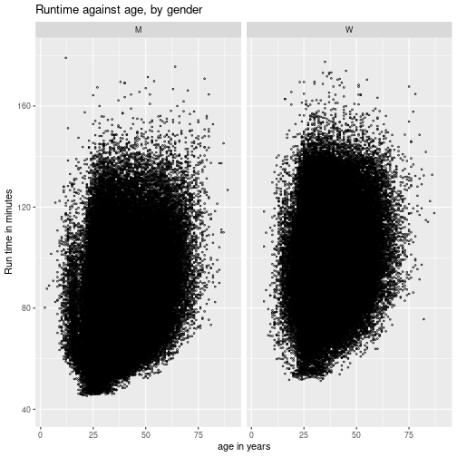
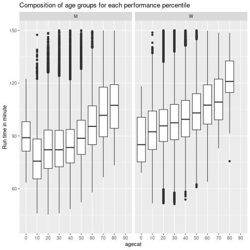
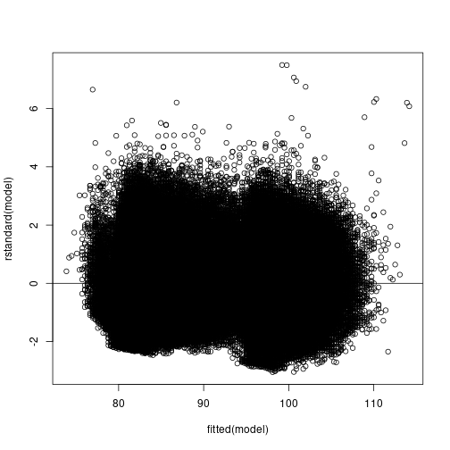
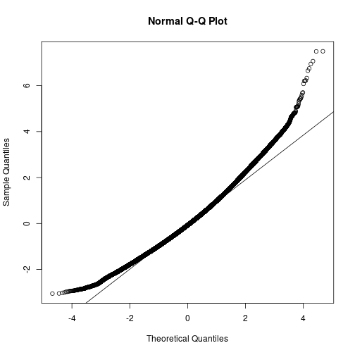
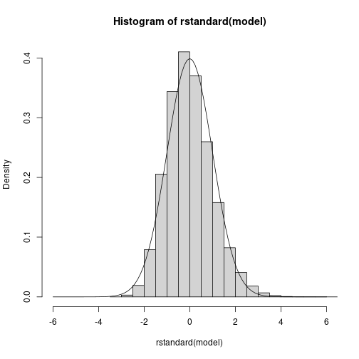
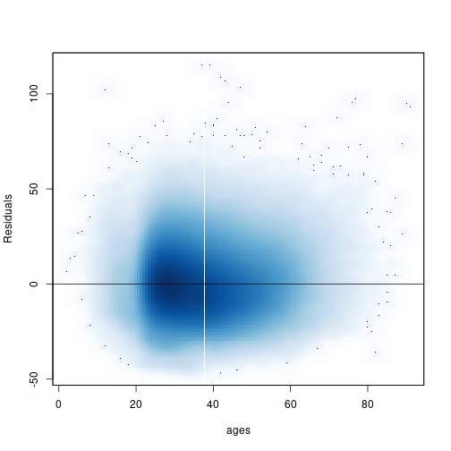
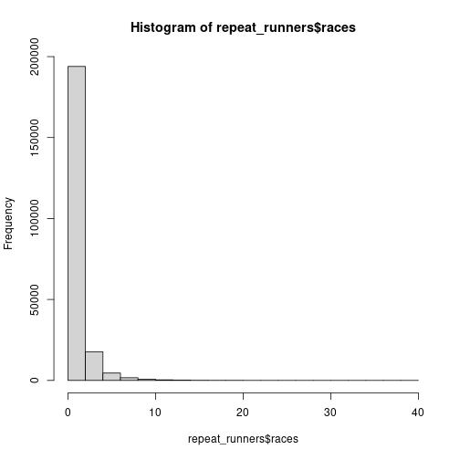

```r
# load in cleaned data
df <- read.csv(file = "cleaned_data_csv.csv")
repeat_runners <- read.csv(file = "same_runners.csv")
```


```r
# renaming variables for convenience and consistency
df <- df %>%
  rename(year = Year) %>%
  rename(name = Name) %>%
  rename(age = Age) %>%
  rename(t_hour = T_Hour) %>%
  rename(t_min = T_Min) %>%
  rename(t_sec = T_Sec) %>%
  rename(p_min = P_Min) %>%
  rename(p_sec = P_Sec) %>%
  rename(pis.tis = PiS.TiS) %>%
  rename(pid.tid = PiD.TiD) %>%
  rename(hometown = Hometown)

repeat_runners <- repeat_runners %>%
  rename(name = Name) %>%
  rename(year_of_birth = Year...Age) %>%
  rename(hometown = Hometown) %>%
  rename(races = Races_Ran)
```


```r
# converting Time/Pace into minutes and putting them in separate columns
df <- df %>%
  mutate(time = t_hour * 60 + t_min + t_sec / 60,
         pace = p_min + p_sec / 60)

## create gender column from name
getgender <- function(x) {
  substr(x, nchar(x) - 1, nchar(x) - 1)
}

#
repeat_runners$name <- iconv(enc2utf8(repeat_runners$name), sub = "byte")
repeat_runners <- repeat_runners %>%
  mutate(gender = sapply(name, getgender)) %>%
  mutate(name = str_sub(name, 1, -5))

#
unique(repeat_runners$gender) # 1 case F instead of W
```

```
## [1] "M" "W" "F"
```

```r
repeat_runners <- repeat_runners %>%
  mutate(gender = case_when(gender == "F" ~ "W", TRUE ~ gender))

#
df$name <- iconv(enc2utf8(df$name), sub = "byte")
df <- df %>%
  mutate(gender = sapply(name, getgender)) %>%
  mutate(name = str_sub(name, 1, -5))

#
unique(df$gender) # 1 case F instead of W
```

```
## [1] "M" "W" "F"
```

```r
df <- df %>%
  mutate(gender = case_when(gender == "F" ~ "W", TRUE ~ gender))
```


```r
# Plot "runtime" against "age"
ggplot(data = df,
       aes(x = age,
           y = time)) +
  geom_point(shape = 1, size = 0.5) +
  xlab("age in years") +
  ylab("Run time in minutes") +
  ylim(40, 180) +
  ggtitle("Runtime against age, by gender") +
  facet_wrap(gender ~ .)
```

```
## Warning: Removed 1196 rows containing missing values (`geom_point()`).
```




```r
# Boxplot runtime against age category, by gender
## Create age group by decade
df <- df %>%
    mutate(agecat = 10 * floor(age / 10)) %>%
    mutate(agecat = as.character(agecat))

ggplot(data = df,
  aes(x = agecat,
      y = time)) + # by age groups in decades
  geom_boxplot() + # boxplot
  ylab("Run time in minute") +
  ylim(40, 150) +
  ggtitle("Composition of age groups for each performance percentile") +
  labs(fill = "age groups in decade") +
  facet_wrap(gender ~ .)
```

```
## Warning: Removed 1509 rows containing non-finite values (`stat_boxplot()`).
```




```r
# Linear regression
df <- df %>%
  filter(!is.na(time))
model <- lm(time ~ age + gender + age:gender, data = df)
summary(model)
```

```
## 
## Call:
## lm(formula = time ~ age + gender + age:gender, data = df)
## 
## Residuals:
##     Min      1Q  Median      3Q     Max 
## -46.843 -10.726  -1.149   9.425 115.116 
## 
## Coefficients:
##              Estimate Std. Error t value Pr(>|t|)    
## (Intercept) 73.248319   0.138429 529.139  < 2e-16 ***
## age          0.308354   0.003458  89.177  < 2e-16 ***
## genderW     15.721519   0.197472  79.614  < 2e-16 ***
## age:genderW -0.031402   0.005228  -6.006  1.9e-09 ***
## ---
## Signif. codes:  0 '***' 0.001 '**' 0.01 '*' 0.05 '.' 0.1 ' ' 1
## 
## Residual standard error: 15.36 on 340331 degrees of freedom
## Multiple R-squared:  0.1861,	Adjusted R-squared:  0.1861 
## F-statistic: 2.595e+04 on 3 and 340331 DF,  p-value: < 2.2e-16
```


```r
# Residual diagnostic
plot(fitted(model), rstandard(model))
abline(0, 0) # residual pattern against fitted response
```



```r
qqnorm(rstandard(model))

qqline(rstandard(model)) # normality of residual
```



```r
hist(rstandard(model),
  breaks = 30,
  xlim = c(-6, 6),
  freq = FALSE)
curve(dnorm, add = TRUE)
```



```r
smoothScatter(x = df$age,
  y = model$residuals,
  xlab = "ages",
  ylab = "Residuals")
abline(h = 0)
```



```r
# # DISABLED: this takes a reallyyyyy long time: temporarily disabling
# resid.lo <- loess(resids ~ age,
#   data = data.frame(resids = rstandard(model),
#   age = df$age))

# res.lo.pred <- predict(resid.lo, newdata = data.frame(age = 10:100))
#   smoothScatter(x = df$age,
#     y = model$residuals,
#     xlab = "ages",
#     ylab = "Residuals")
# abline(h = 0)
# lines(x = 10:100, y = res.lo.pred, col = "red", lwd = 2, lty = 3)
```


```r
# Non parametric model
df.m <- df[df$gender == "M",]
df.w <- df[df$gender == "W",]


# # DISABLED: this takes a reallyyyyy long time: temporarily disabling
# model.loess.m <- loess(time ~ age, data = df.m)
# model.loess.w <- loess(time ~ age, data = df.w)

# plot(y = predict(model.loess.m), x = df.m$age,
#      xlab = "age",
#      ylab = "Predicted time (minutes)",
#      main = "Prediction of Performance using Nonparametric model - Men (Loess method)")

# plot(y=predict(model.loess.w), x=df.w$age,
#      xlab = "age",
#      ylab = "Predicted time (minutes)",
#      main = "Prediction of Performance using Nonparametric model - Women (Loess method)")
```


```r
# NEED SOME DESCRIPTIVE STATISTICS HERE!
# TABLES and GRAPHS show info of age, running time, missing data, number of
# observations (average, median, max, min) by YEAR
# eg. histogram of age (show the composition of age in each race, remember to
# include the number of observations in notes/legend/etc)
# eg. histogram of age by gender (for those years that number of repeat_runners are
# stable and without many missing data - LOOK OUT FOR MISSING DATA - is there a
# pattern in missing data???)

# A GRAPH IN VIZUALIZATION LAB WE DIDN"T NEED TO DRAW
# the one I sent on 11/14/2022 10:44 AM

# Maybe the GRAPH IN VIZUALIZATION LAB we did draw as our answer.

# Answer questions (with graph and/or statistics):
# ? What is the peak performing age for men? for women?
# https://pubmed.ncbi.nlm.nih.gov/31174325/
# ? What is the slow down rate after peak age of men? of women? (percent per
# decade? choose another unit of measurement if you find it"s more
# accurate/intuitive)
```


```r
# MODEL FOR TRACKED RUNNERS RECORDS

hist(repeat_runners$races)
```



```r
# QUESTIONS
# ? Who have lower age-related decline (percent per decade) in performance?
# elite repeat_runners or mortal (based on running time to decide who are elite repeat_runners
# or based on Cherry Blossom elite repeat_runners record)? men/women? -> recommendation
# to take up running as a hobby, professional training?
# https://www.frontiersin.org/articles/10.3389/fphys.2021.649282/full
# actually, I think this should be done with the tracked runner record rather
# than cross-section data - will look into it.
# https://researchoutreach.org/articles/ageing-change-sport-performance-master-athletes-answer/
```


```r
# # DISABLED: this takes a reallyyyyy long time: temporarily disabling
# resid.lo <- loess(resids ~ age,
#   data = data.frame(resids = rstandard(model),
#   age = df$age))
# res.lo.pred <- predict(resid.lo, newdata = data.frame(age = 10:100))

# smoothScatter(x = df$age,
#   y = model$residuals,
#   xlab = "ages",
#   ylab = "Residuals")

# abline(h = 0)
# lines(x = 10:100,
#     y = res.lo.pred,
#     col = "red",
#     lwd = 2,
#     lty = 3)
```


```r
rdplot(narrow$yvar, narrow$school_enrollment, c = 40.5, p = 1, nbins = 20)
```


```r
#Collapse data
by_school <- group_by(narrow, schlcode)
schools <- summarise(by_school, school_enrollment =
mean(school_enrollment, na.rm = TRUE))
#Draw graph
ggplot(schools, aes(school_enrollment)) +
 geom_histogram(bins = 40) +
 geom_vline(xintercept = 40.5, color = "red")
#Save graph
ggsave("school_counts.png")
```


```r
# Use PiS/Tis to create place in percentile
## Extract position and total number of repeat_runners in each race
df <- df %>%
  mutate(race_size = sapply(strsplit(place, "/"),
    function(x) as.numeric(x[2]))) %>%
  mutate(place = sapply(strsplit(place, "/"),
    function(x) as.numeric(x[1])))
```

