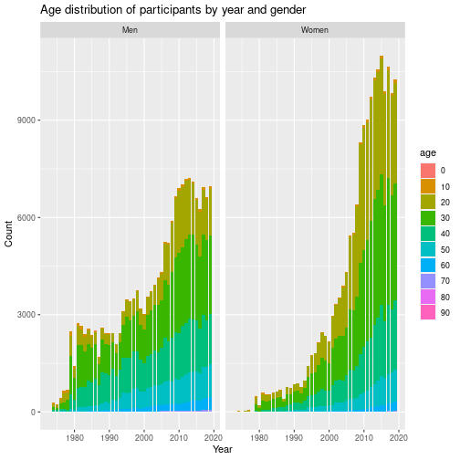
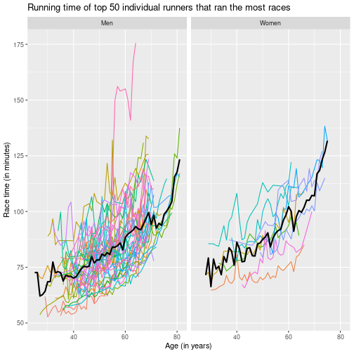
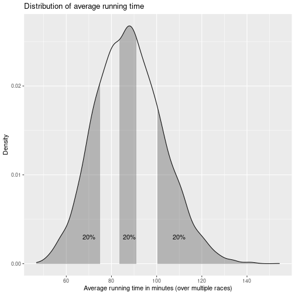

```r
# library inclusions
require(dplyr)
require(stringr)
require(tidyr)
require(ggplot2)
require(rdrobust)
require(AER)
require(plm)
require(stargazer)
```


```r
# load in cleaned data
df <- read.csv(file = "cleaned_data_csv.csv")
repeat_runners <- read.csv(file = "same_runners.csv")
```


```r
# renaming variables for convenience and consistency
df <- df %>%
  rename(year = Year) %>%
  rename(name = Name) %>%
  rename(age = Age) %>%
  rename(t_hour = T_Hour) %>%
  rename(t_min = T_Min) %>%
  rename(t_sec = T_Sec) %>%
  rename(p_min = P_Min) %>%
  rename(p_sec = P_Sec) %>%
  rename(pis.tis = PiS.TiS) %>%
  rename(pid.tid = PiD.TiD) %>%
  rename(hometown = Hometown)

repeat_runners <- repeat_runners %>%
  rename(name = Name) %>%
  rename(year_of_birth = Year...Age) %>%
  rename(hometown = Hometown) %>%
  rename(races = Races_Ran)
```


```r
# converting Time/Pace into minutes and putting them in separate columns
df <- df %>%
  mutate(time = t_hour * 60 + t_min + t_sec / 60,
         pace = p_min + p_sec / 60)

## create gender column from name
getgender <- function(x) {
  substr(x, nchar(x) - 1, nchar(x) - 1)
}

#
repeat_runners$name <- iconv(enc2utf8(repeat_runners$name), sub = "byte")
repeat_runners <- repeat_runners %>%
  mutate(gender = sapply(name, getgender)) %>%
  mutate(name = str_sub(name, 1, -5))

#
unique(repeat_runners$gender) # 1 case F instead of W
```

```
## [1] "M" "W" "F"
```

```r
repeat_runners <- repeat_runners %>%
  mutate(gender = case_when(gender == "F" ~ "W", TRUE ~ gender))

#
df$name <- iconv(enc2utf8(df$name), sub = "byte")
df <- df %>%
  mutate(gender = sapply(name, getgender)) %>%
  mutate(name = str_sub(name, 1, -5))

#
unique(df$gender) # 1 case F instead of W
```

```
## [1] "M" "W" "F"
```

```r
df <- df %>%
  mutate(gender = case_when(gender == "F" ~ "W", TRUE ~ gender))
```


```r
# Plot "runtime" against "age"
ggplot(data = df,
       aes(x = age,
           y = time)) +
  geom_point(shape = 1, size = 0.5) +
  xlab("age in years") +
  ylab("Run time in minutes") +
  ylim(40, 180) +
  ggtitle("Runtime against age, by gender") +
  facet_wrap(gender ~ .)
```

```
## Warning: Removed 1196 rows containing missing values (`geom_point()`).
```


```r
# Boxplot runtime against age category, by gender
## Create age group by decade
df <- df %>%
    mutate(agecat = 10 * floor(age / 10)) %>%
    mutate(agecat = as.character(agecat))

ggplot(data = df %>%
         mutate(gender=case_when(
           gender=="M" ~ "Men",
           gender=="W" ~ "Women"
         )),
  aes(x = agecat,
      y = time)) + # by age groups in decades
  geom_boxplot() + # boxplot
  xlab("Age in decades") +
  ylab("Run time in minutes") +
  ylim(40, 150) +
  ggtitle("Running performance for age groups (in decades)") +
  facet_wrap(gender ~ .)
```

```
## Warning: Removed 1509 rows containing non-finite values (`stat_boxplot()`).
```


```r
# Linear regression
df <- df %>%
  filter(!is.na(time))
model <- lm(time ~ age + gender + age:gender, data = df)
summary(model)
```

```
## 
## Call:
## lm(formula = time ~ age + gender + age:gender, data = df)
## 
## Residuals:
##     Min      1Q  Median      3Q     Max 
## -46.843 -10.726  -1.149   9.425 115.116 
## 
## Coefficients:
##              Estimate Std. Error t value Pr(>|t|)    
## (Intercept) 73.248319   0.138429 529.139  < 2e-16 ***
## age          0.308354   0.003458  89.177  < 2e-16 ***
## genderW     15.721519   0.197472  79.614  < 2e-16 ***
## age:genderW -0.031402   0.005228  -6.006  1.9e-09 ***
## ---
## Signif. codes:  0 '***' 0.001 '**' 0.01 '*' 0.05 '.' 0.1 ' ' 1
## 
## Residual standard error: 15.36 on 340331 degrees of freedom
## Multiple R-squared:  0.1861,	Adjusted R-squared:  0.1861 
## F-statistic: 2.595e+04 on 3 and 340331 DF,  p-value: < 2.2e-16
```


```r
# Residual diagnostic
plot(fitted(model), rstandard(model)); abline(0, 0) # residual pattern against fitted response
qqnorm(rstandard(model)); qqline(rstandard(model)) # normality of residual
hist(rstandard(model),
  breaks = 30,
  xlim = c(-6, 6),
  freq = FALSE); curve(dnorm, add = TRUE)

smoothScatter(x = df$age,
  y = model$residuals,
  xlab = "ages",
  ylab = "Residuals"); abline(h = 0)

# # DISABLED: this takes a reallyyyyy long time: temporarily disabling
# resid.lo <- loess(resids ~ age,
#   data = data.frame(resids = rstandard(model),
#   age = df$age))

# res.lo.pred <- predict(resid.lo, newdata = data.frame(age = 10:100))
#   smoothScatter(x = df$age,
#     y = model$residuals,
#     xlab = "ages",
#     ylab = "Residuals")
# abline(h = 0)
# lines(x = 10:100, y = res.lo.pred, col = "red", lwd = 2, lty = 3)
```


```r
# Non parametric model
df.m <- df[df$gender == "M",]
df.w <- df[df$gender == "W",]


# # DISABLED: this takes a reallyyyyy long time: temporarily disabling
# model.loess.m <- loess(time ~ age, data = df.m)
# model.loess.w <- loess(time ~ age, data = df.w)

# plot(y = predict(model.loess.m), x = df.m$age,
#      xlab = "age",
#      ylab = "Predicted time (minutes)",
#      main = "Prediction of Performance using Nonparametric model - Men (Loess method)")

# plot(y=predict(model.loess.w), x=df.w$age,
#      xlab = "age",
#      ylab = "Predicted time (minutes)",
#      main = "Prediction of Performance using Nonparametric model - Women (Loess method)")
```


```r
# NEED SOME DESCRIPTIVE STATISTICS HERE!
# TABLES and GRAPHS show info of age, running time, missing data, number of
# observations (average, median, max, min) by YEAR
# eg. histogram of age (show the composition of age in each race, remember to
# include the number of observations in notes/legend/etc)
# eg. histogram of age by gender (for those years that number of repeat_runners are
# stable and without many missing data - LOOK OUT FOR MISSING DATA - is there a
# pattern in missing data???)

# A GRAPH IN VIZUALIZATION LAB WE DIDN"T NEED TO DRAW
# the one I sent on 11/14/2022 10:44 AM

# Maybe the GRAPH IN VIZUALIZATION LAB we did draw as our answer.

# Answer questions (with graph and/or statistics):
# ? What is the peak performing age for men? for women?
# https://pubmed.ncbi.nlm.nih.gov/31174325/
# ? What is the slow down rate after peak age of men? of women? (percent per
# decade? choose another unit of measurement if you find it"s more
# accurate/intuitive)

# temporary dataframe
temp <- df %>%
  select(year, age, gender) %>%
  mutate(age = as.character(10 * floor(age / 10)))

  # stacked line plot showing age distribution for year
ggplot() +
  geom_bar(data = temp,
    aes(x = year, fill = age, group = age)) +
  xlab("Year") +
  ylab("Count") +
  facet_wrap(. ~ gender)
```



```r
# not sure if this is what we are looking for...

year_age_summary <- temp %>% group_by(year, gender) %>% summarise(n = n())
```

```
## `summarise()` has grouped output by 'year'. You can override using the `.groups`
## argument.
```

```r
# show mean, median, min, max of number of observations per year
summary(year_age_summary)
```

```
##       year         gender                n        
##  Min.   :1973   Length:93          Min.   :    2  
##  1st Qu.:1985   Class :character   1st Qu.:  868  
##  Median :1996   Mode  :character   Median : 2647  
##  Mean   :1996                      Mean   : 3660  
##  3rd Qu.:2008                      3rd Qu.: 5904  
##  Max.   :2019                      Max.   :10984
```

```r
# show breakdown by year
as.data.frame(year_age_summary)
```

```
##    year gender     n
## 1  1973      M     2
## 2  1974      M   305
## 3  1974      W    27
## 4  1975      M   225
## 5  1975      W    14
## 6  1976      M   436
## 7  1976      W    45
## 8  1977      M   655
## 9  1977      W    65
## 10 1978      M   677
## 11 1978      W    23
## 12 1979      M  2495
## 13 1979      W   481
## 14 1980      M  1407
## 15 1980      W   210
## 16 1981      M  2749
## 17 1981      W   589
## 18 1982      M  2647
## 19 1982      W   533
## 20 1983      M  2408
## 21 1983      W   538
## 22 1984      M  2566
## 23 1984      W   600
## 24 1985      M  2385
## 25 1985      W   632
## 26 1986      M  2502
## 27 1986      W   674
## 28 1987      M  1686
## 29 1987      W   414
## 30 1988      M  2614
## 31 1988      W   767
## 32 1989      M  2445
## 33 1989      W   733
## 34 1990      M  2417
## 35 1990      W   868
## 36 1991      M  2441
## 37 1991      W   886
## 38 1992      M  2100
## 39 1992      W   767
## 40 1993      M  2445
## 41 1993      W   966
## 42 1994      M  3105
## 43 1994      W  1428
## 44 1995      M  3463
## 45 1995      W  1744
## 46 1996      M  3412
## 47 1996      W  1824
## 48 1997      M  3512
## 49 1997      W  2149
## 50 1998      M  3750
## 51 1998      W  2461
## 52 1999      M  3188
## 53 1999      W  2354
## 54 2000      M  3016
## 55 2000      W  2166
## 56 2001      M  3555
## 57 2001      W  2971
## 58 2002      M  3723
## 59 2002      W  3330
## 60 2003      M  3924
## 61 2003      W  3525
## 62 2004      M  4141
## 63 2004      W  3885
## 64 2005      M  4314
## 65 2005      W  4323
## 66 2006      M  5236
## 67 2006      W  5435
## 68 2007      M  5218
## 69 2007      W  5531
## 70 2008      M  5904
## 71 2008      W  6395
## 72 2009      M  6652
## 73 2009      W  8322
## 74 2010      M  6906
## 75 2010      W  8853
## 76 2011      M  7009
## 77 2011      W  9030
## 78 2012      M  7194
## 79 2012      W  9727
## 80 2013      M  7215
## 81 2013      W 10323
## 82 2014      M  7117
## 83 2014      W 10566
## 84 2015      M  6600
## 85 2015      W 10984
## 86 2016      M  6252
## 87 2016      W  9893
## 88 2017      M  6933
## 89 2017      W 10645
## 90 2018      M  6638
## 91 2018      W  9834
## 92 2019      M  6972
## 93 2019      W 10249
```

```r
# show breakdown by gender
year_age_summary <- temp %>% group_by(gender, year) %>% summarise(n = n())
```

```
## `summarise()` has grouped output by 'gender'. You can override using the
## `.groups` argument.
```

```r
as.data.frame(year_age_summary)
```

```
##    gender year     n
## 1       M 1973     2
## 2       M 1974   305
## 3       M 1975   225
## 4       M 1976   436
## 5       M 1977   655
## 6       M 1978   677
## 7       M 1979  2495
## 8       M 1980  1407
## 9       M 1981  2749
## 10      M 1982  2647
## 11      M 1983  2408
## 12      M 1984  2566
## 13      M 1985  2385
## 14      M 1986  2502
## 15      M 1987  1686
## 16      M 1988  2614
## 17      M 1989  2445
## 18      M 1990  2417
## 19      M 1991  2441
## 20      M 1992  2100
## 21      M 1993  2445
## 22      M 1994  3105
## 23      M 1995  3463
## 24      M 1996  3412
## 25      M 1997  3512
## 26      M 1998  3750
## 27      M 1999  3188
## 28      M 2000  3016
## 29      M 2001  3555
## 30      M 2002  3723
## 31      M 2003  3924
## 32      M 2004  4141
## 33      M 2005  4314
## 34      M 2006  5236
## 35      M 2007  5218
## 36      M 2008  5904
## 37      M 2009  6652
## 38      M 2010  6906
## 39      M 2011  7009
## 40      M 2012  7194
## 41      M 2013  7215
## 42      M 2014  7117
## 43      M 2015  6600
## 44      M 2016  6252
## 45      M 2017  6933
## 46      M 2018  6638
## 47      M 2019  6972
## 48      W 1974    27
## 49      W 1975    14
## 50      W 1976    45
## 51      W 1977    65
## 52      W 1978    23
## 53      W 1979   481
## 54      W 1980   210
## 55      W 1981   589
## 56      W 1982   533
## 57      W 1983   538
## 58      W 1984   600
## 59      W 1985   632
## 60      W 1986   674
## 61      W 1987   414
## 62      W 1988   767
## 63      W 1989   733
## 64      W 1990   868
## 65      W 1991   886
## 66      W 1992   767
## 67      W 1993   966
## 68      W 1994  1428
## 69      W 1995  1744
## 70      W 1996  1824
## 71      W 1997  2149
## 72      W 1998  2461
## 73      W 1999  2354
## 74      W 2000  2166
## 75      W 2001  2971
## 76      W 2002  3330
## 77      W 2003  3525
## 78      W 2004  3885
## 79      W 2005  4323
## 80      W 2006  5435
## 81      W 2007  5531
## 82      W 2008  6395
## 83      W 2009  8322
## 84      W 2010  8853
## 85      W 2011  9030
## 86      W 2012  9727
## 87      W 2013 10323
## 88      W 2014 10566
## 89      W 2015 10984
## 90      W 2016  9893
## 91      W 2017 10645
## 92      W 2018  9834
## 93      W 2019 10249
```

Model using panel data may mitigate omitted variable bias when there is no information on variables that correlate with both the regressors of interest and the independent variable and if these variables are constant in the time dimension or across entities.


```r
# MODEL FOR TRACKED RUNNERS RECORDS

# install.packages("plm")
# install.packages("stargazer")
# install.packages("AER")
library(AER)
library(plm)
library(stargazer)

hist(repeat_runners$races)
```


```r
## Create key variable in df to merge later
df <- df %>% mutate(year_of_birth=year-age)

# create ID for each runner in repeat runner list
rerun <- repeat_runners %>%
  mutate(id=row_number()) %>%
  select(id, name:gender)

## Filter those who ran at least 5 races
rerun <- rerun %>% filter(races>=5)

## Merge the performance info from df
rerun <- rerun %>% left_join(y = df,by = c("name","year_of_birth","gender","hometown"))

check_merge <- rerun %>% # number of races not agree with number of records (maybe due to change of hometown)
  group_by(id) %>%
  summarise(n_races=mean(races),
            n_merge=n()) %>%
  filter(n_races != n_merge)

rerun_dup <- rerun %>% # multiple people with same id (name, yob, gender, hometown) and different performance
  group_by(id,year) %>%
  mutate(n_dup=n()) %>%
  filter(n_dup>1)

# remove merging error
rerun <- rerun %>%
  group_by(id,year) %>%
  mutate(n_dup=n()) %>%
  filter(n_dup==1) %>%
  select(-n_dup)

## Random sampling
# set.seed(2022)
# rerun[rerun$id==sample(max(rerun$id), size=2), ]

## Change id, gender, year to factor variables
rerun <- within(rerun, {
  id <- factor(id)
  gender <- factor(gender)
  year <- factor(year)
})
head(rerun)
```

```
## # A tibble: 6 × 18
## # Groups:   id, year [6]
##   id    name   year_…¹ homet…² races gender year    age t_hour t_min t_sec p_min
##   <fct> <chr>    <int> <chr>   <int> <fct>  <fct> <int>  <int> <int> <int> <int>
## 1 1     Jay J…    1950 Arling…    39 M      1979     29      1     1    48     6
## 2 1     Jay J…    1950 Arling…    39 M      1980     30      0    52    41     5
## 3 1     Jay J…    1950 Arling…    39 M      1981     31      0    54    47     5
## 4 1     Jay J…    1950 Arling…    39 M      1982     32      0    56    53     5
## 5 1     Jay J…    1950 Arling…    39 M      1983     33      0    57    52     5
## 6 1     Jay J…    1950 Arling…    39 M      1984     34      0    54    51     5
## # … with 6 more variables: p_sec <int>, pis.tis <chr>, pid.tid <chr>,
## #   time <dbl>, pace <dbl>, agecat <chr>, and abbreviated variable names
## #   ¹​year_of_birth, ²​hometown
```

```r
## Panel data graph for first 10 runners

ggplot(data = rerun %>%
         filter(as.numeric(id)<11) %>%
         mutate(gender = case_when(
           gender=="M"~"Men",
           gender=="W"~"Women"
         )),
       aes(x = age, y = time, group = id)) +
  geom_line(aes(color=id)) + # line graph
  xlab("Age (in years)") +
  ylab("Race time (in minutes)") +
  ggtitle("Running time of top 10 individual runners that participated in the most races") +
  theme(legend.position="none")
```


```r
## Panel data graph for first 50 runners by gender
ggplot(data = rerun %>%
         filter(as.numeric(id)<51) %>%
         mutate(gender = case_when(
           gender=="M"~"Men",
           gender=="W"~"Women"
         )),
       aes(x = age, y = time, group = id)) +
  geom_line(aes(color=id)) + # line graph
  xlab("Age (in years)") +
  ylab("Race time (in minutes)") +
  ggtitle("Running time of top 50 individual runners that ran the most races") +
  facet_grid(.~ gender) +
  theme(legend.position="none") +
  stat_summary(group= F, geom="line", fun = "mean", color="black", size=1, linetype="solid")
```

```
## Warning: Using `size` aesthetic for lines was deprecated in ggplot2 3.4.0.
## ℹ Please use `linewidth` instead.
```



```r
## Panel data graph for first 50 runners by gender with smooth line
ggplot(data = rerun %>%
         filter(as.numeric(id)<51) %>%
         mutate(gender = case_when(
           gender=="M"~"Men",
           gender=="W"~"Women"
         )),
       aes(x = age, y = time, group = id)) +
  geom_line(aes(color=id)) + # line graph
  xlab("Age (in years)") +
  ylab("Race time (in minutes)") +
  ggtitle("Running time of top 50 individual runners that ran the most races") +
  facet_grid(.~ gender) +
  theme(legend.position="none") +
  # stat_summary(group= F, geom="line", fun = "mean", color="black", size=1, linetype="solid") +
  geom_smooth(group= F, method = "loess", fill = NA)
```

```
## `geom_smooth()` using formula = 'y ~ x'
```


Based on the average line and Loess smooth line, two possible models are linear and quadratic model.


```r
## OVERALL PANEL DATA MODEL

### Linear model
model.panel_l <- plm(time~age + gender+age:gender,
                   data = rerun %>%
                     mutate(gender= case_when(
                       gender=="M" ~ "Men",
                       gender=="W" ~ "Women"
                     )),
                   index=c("id", "year"),
                   model = "within",
                   effect = "time")
```

```
## Warning in pdata.frame(data, index): at least one NA in at least one index dimension in resulting pdata.frame
##  to find out which, use, e.g., table(index(your_pdataframe), useNA = "ifany")
```

```r
coeftest(model.panel_l, vcov. = vcovHC, type = "HC1")
```

```
## 
## t test of coefficients:
## 
##                  Estimate Std. Error t value  Pr(>|t|)    
## age              0.433327   0.018099 23.9421 < 2.2e-16 ***
## genderWomen     18.863707   1.225592 15.3915 < 2.2e-16 ***
## age:genderWomen -0.175017   0.028709 -6.0963 1.093e-09 ***
## ---
## Signif. codes:  0 '***' 0.001 '**' 0.01 '*' 0.05 '.' 0.1 ' ' 1
```

```r
### Quadratic model
model.panel_q <- plm(time~ age + age2 + gender
                     + age:gender + age2:gender,
                   data = rerun %>%
                     mutate(age2 = age^2) %>%
                     mutate(gender= case_when(
                       gender=="M" ~ "Men",
                       gender=="W" ~ "Women"
                     )),
                   index=c("id", "year"),
                   model = "within",
                   effect = "time")
```

```
## Warning in pdata.frame(data, index): at least one NA in at least one index dimension in resulting pdata.frame
##  to find out which, use, e.g., table(index(your_pdataframe), useNA = "ifany")
```

```r
coeftest(model.panel_q, vcov. = vcovHC, type = "HC1")
```

```
## 
## t test of coefficients:
## 
##                    Estimate Std. Error t value  Pr(>|t|)    
## age              -0.4539771  0.1169561 -3.8816 0.0001039 ***
## age2              0.0095219  0.0013044  7.2996 2.925e-13 ***
## genderWomen      10.2275025  3.8157079  2.6804 0.0073563 ** 
## age:genderWomen   0.1840870  0.1790245  1.0283 0.3038235    
## age2:genderWomen -0.0035009  0.0020393 -1.7167 0.0860378 .  
## ---
## Signif. codes:  0 '***' 0.001 '**' 0.01 '*' 0.05 '.' 0.1 ' ' 1
```

```r
### Choose between the two (linear vs. quadratic)
Sum1 <- summary(model.panel_l)
RSS1 <- sum(Sum1$residuals^2)
K1 <- max(model.panel_l$assign)
N1 <- length(model.panel_l$residuals)
n1 <- N1 - K1 - model.panel_l$df.residual

AIC_model.panel_l = log(RSS1/n1) + (2*K1)/n1

Sum2 <- summary(model.panel_q)
RSS2 <- sum(Sum2$residuals^2)
K2 <- max(model.panel_q$assign)
N2 <- length(model.panel_q$residuals)
n2 <- N2 - K2 - model.panel_q$df.residual

AIC_model.panel_q = log(RSS2/n2) + (2*K2)/n2
```

Is linear model better than second order model?

```r
AIC_model.panel_l<AIC_model.panel_q
```

```
## [1] TRUE
```

```r
## Panel model residual diagnostics
qqnorm(model.panel_l$residuals); qqline(model.panel_l$residuals)
```


```r
boxcoxResult<-MASS::boxcox(time ~ age + gender +age:gender +year, data = rerun)
```


```r
lambda = boxcoxResult$x[which.max(boxcoxResult$y)];lambda
```

```
## [1] -0.06060606
```

```r
### lambda close to 0 so do log-transformation of time

model.panel_l <- plm(log_time~age + gender+age:gender,
                   data = rerun %>%
                     mutate(log_time=log(time)) %>%
                     mutate(gender= case_when(
                       gender=="M" ~ "Men",
                       gender=="W" ~ "Women"
                     )),
                   index=c("id", "year"),
                   model = "within",
                   effect = "time")
```

```
## Warning in pdata.frame(data, index): at least one NA in at least one index dimension in resulting pdata.frame
##  to find out which, use, e.g., table(index(your_pdataframe), useNA = "ifany")
```

```r
coeftest(model.panel_l, vcov. = vcovHC, type = "HC1")
```

```
## 
## t test of coefficients:
## 
##                    Estimate  Std. Error t value  Pr(>|t|)    
## age              0.00511459  0.00020357 25.1251 < 2.2e-16 ***
## genderWomen      0.23557247  0.01341752 17.5571 < 2.2e-16 ***
## age:genderWomen -0.00245713  0.00030610 -8.0271 1.017e-15 ***
## ---
## Signif. codes:  0 '***' 0.001 '**' 0.01 '*' 0.05 '.' 0.1 ' ' 1
```

```r
model.panel_l$coefficients
```

```
##             age     genderWomen age:genderWomen 
##     0.005114592     0.235572473    -0.002457131
```


```r
# generate predict function
pred_log <- function(data, model) {
  data$pred_time = exp(predict(model)); data
}
pred_log(rerun, model = model.panel_l)
ggplot(data = pred_log(rerun, model.panel_l) %>%
         filter(age>=10),
       aes(x = age, y = time, group = id)) +
  geom_line(aes(color=id)) + # line graph
  xlab("Age") +
  ylab("Race time") +
  ggtitle("Running time of tracked runners throughout races predicted") +
  labs(title = "Predicted running time of tracked runners throughout races",
       subtitle = "Log-level time-fixed effect model",
       caption = "") +
  theme(legend.position="none") +
  # geom_abline(slope=model.panel_t1$coefficients[1],
  #             intercept= summary(t1_check)$coefficients[1,1],
  #             color='red') +
  geom_smooth(group=F, aes(y=pred_time), se=F, method = "loess")
```

Final model (log-level model) using log-transformed racing time:

- Men: One year older is associated with 0.5% in running time

- Women: One year older is associated with 0.3% in running time

- On average, women is slower than men by 26.6%


### Split data by gender and choose model
### Linear model

```r
model.panel_l_m <- plm(time~age,
                   data = rerun %>%
                     filter(gender=="M") %>%
                     mutate(gender= case_when(
                       gender=="M" ~ "Men",
                       gender=="W" ~ "Women"
                     )),
                   index=c("id", "year"),
                   model = "within",
                   effect = "time")
```

```
## Warning in pdata.frame(data, index): at least one NA in at least one index dimension in resulting pdata.frame
##  to find out which, use, e.g., table(index(your_pdataframe), useNA = "ifany")
```

```r
coeftest(model.panel_l_m, vcov. = vcovHC, type = "HC1")
```

```
## 
## t test of coefficients:
## 
##     Estimate Std. Error t value  Pr(>|t|)    
## age 0.435910   0.018227  23.916 < 2.2e-16 ***
## ---
## Signif. codes:  0 '***' 0.001 '**' 0.01 '*' 0.05 '.' 0.1 ' ' 1
```

```r
### Quadratic model
model.panel_q_m <- plm(time~ age + age2,
                   data = rerun %>%
                     filter(gender=="M") %>%
                     mutate(age2 = age^2) %>%
                     mutate(gender= case_when(
                       gender=="M" ~ "Men",
                       gender=="W" ~ "Women"
                     )),
                   index=c("id", "year"),
                   model = "within",
                   effect = "time")
```

```
## Warning in pdata.frame(data, index): at least one NA in at least one index dimension in resulting pdata.frame
##  to find out which, use, e.g., table(index(your_pdataframe), useNA = "ifany")
```

```r
coeftest(model.panel_q_m, vcov. = vcovHC, type = "HC1")
```

```
## 
## t test of coefficients:
## 
##        Estimate Std. Error t value  Pr(>|t|)    
## age  -0.4633102  0.1178320 -3.9320 8.442e-05 ***
## age2  0.0096500  0.0013148  7.3393 2.194e-13 ***
## ---
## Signif. codes:  0 '***' 0.001 '**' 0.01 '*' 0.05 '.' 0.1 ' ' 1
```

```r
### Choose between the two (linear vs. quadratic)
Sum1 <- summary(model.panel_l_m)
RSS1 <- sum(Sum1$residuals^2)
K1 <- max(model.panel_l_m$assign)
N1 <- length(model.panel_l_m$residuals)
n1 <- N1 - K1 - model.panel_l_m$df.residual

AIC_model.panel_l_m = log(RSS1/n1) + (2*K1)/n1

Sum2 <- summary(model.panel_q_m)
RSS2 <- sum(Sum2$residuals^2)
K2 <- max(model.panel_q_m$assign)
N2 <- length(model.panel_q_m$residuals)
n2 <- N2 - K2 - model.panel_q_m$df.residual

AIC_model.panel_q_m = log(RSS2/n2) + (2*K2)/n2
```

Is linear model better than second order model?

```r
AIC_model.panel_l_m <AIC_model.panel_q_m
```

```
## [1] TRUE
```

## Difference between elite and non-elite runners

In this section, tracked runners are divided into 03 types of runners: Type 1 - Runners whose average performance is at most 60 minutes; Type 2 - Runners whose average performance is between 80 to 90 minutes; Type 3 - Runners who need at least 110 minutes on average to complete the race. The question investigated in this section is:  Who have lower age-related decline (percent per decade) in performance? Linear model regression is used for simplicity of the interpretation.


```r
# TWO GROUPS OF RUNNERS - ELITE RUNNERS (MORE RACES AND BETTER AVERAGE PERFORMANCE) vs the rest

## Create two types of runners
rerun <- rerun %>%
  mutate(race_size = sapply(strsplit(pis.tis, "/"),
    function(x) as.numeric(x[2]))) %>%
  mutate(place = sapply(strsplit(pis.tis, "/"),
    function(x) as.numeric(x[1])))
```

```
## Warning in FUN(X[[i]], ...): NAs introduced by coercion

## Warning in FUN(X[[i]], ...): NAs introduced by coercion

## Warning in FUN(X[[i]], ...): NAs introduced by coercion
```

```r
# print( rerun %>% filter( place > race_size ) )
rerun <- rerun %>%
  filter(place <= race_size) # discard data errors
rerun <- rerun %>%
  mutate(percentile = 10 * ceiling( 10 * place/race_size))

rerun <- rerun %>%
  group_by(id) %>%
  mutate(avg_time = mean(time),
         avg_performance = mean(percentile))

rerun_type <- rerun %>%
  group_by(id, name, races, year_of_birth, gender) %>%
  summarise(avg_time = mean(time),
         avg_performance = mean(percentile))
```

```
## `summarise()` has grouped output by 'id', 'name', 'races', 'year_of_birth'. You can override using the
## `.groups` argument.
```

```r
densityPlot(rerun_type$avg_time, xlab = "Average running time"); title("Distribution of average running time");
```


```r
library(scales)

bounds1 <- c(0, quantile(rerun_type$avg_time, probs = 0.2))
bounds2 <- c(quantile(rerun_type$avg_time, probs = 0.4), quantile(rerun_type$avg_time, probs = 0.6))
bounds3 <- c(quantile(rerun_type$avg_time, probs = 0.8),160)

ggplot(rerun_type, aes(x=avg_time))  +
  stat_density(geom = "line") +
  stat_density(
    geom = "area",
    aes(x = stage(avg_time, after_stat = oob_censor(x, bounds1))),
    alpha = 0.3
  ) +
  stat_density(
    geom = "area",
    aes(x = stage(avg_time, after_stat = oob_censor(x, bounds2))),
    alpha = 0.3
  ) +
  stat_density(
    geom = "area",
    aes(x = stage(avg_time, after_stat = oob_censor(x, bounds3))),
    alpha = 0.3
  ) +
  xlab("Average running time in minutes (over multiple races)") +
  ylab("Density") +
  ggtitle("Distribution of average running time") +
  annotate(
    "text", bounds1[2]-5, y = 0.003,
    label = percent(mean(!is.na(oob_censor(rerun_type$avg_time, bounds1)))))+
  annotate(
    "text", bounds2[2]-3, y = 0.003, 
    label = percent(mean(!is.na(oob_censor(rerun_type$avg_time, bounds2)))))+
  annotate(
    "text", bounds3[2]-50, y = 0.003, 
    label = percent(mean(!is.na(oob_censor(rerun_type$avg_time, bounds3))))
  )
```

```
## Warning: Removed 377 rows containing missing values (`position_stack()`).
```

```
## Warning: Removed 476 rows containing missing values (`position_stack()`).
```

```
## Warning: Removed 255 rows containing missing values (`position_stack()`).
```



```r
## base on this plot ->
## 1. elite = complete the race no more than 60 minutes
## 2. complete the race in between 80-90 minutes
## 3. complete the race in more than 110 minutes

densityPlot(rerun_type[rerun_type$avg_time<=60,]$avg_performance)
```


```r
densityPlot(rerun_type[rerun_type$avg_time<=60,]$races) # elite runners may not participate in many races
```


```r
rerun_type <- rerun_type %>%
  mutate(run_type=as.factor(case_when(
    avg_time<=60 ~ 1,
    avg_time>=80 & avg_time<=90 ~ 2,
    avg_time>=110 ~ 3
  )))

## Check how many people in each type of runners

rerun_type %>%
  group_by(run_type, gender) %>%
  summarise(num_runners=n())
```

```
## `summarise()` has grouped output by 'run_type'. You can override using the
## `.groups` argument.
```

```
## # A tibble: 8 × 3
## # Groups:   run_type [4]
##   run_type gender num_runners
##   <fct>    <fct>        <int>
## 1 2        M             1402
## 2 2        W              616
## 3 3        M              165
## 4 3        W              419
## 5 1        M              166
## 6 1        W                4
## 7 <NA>     M             3168
## 8 <NA>     W             1836
```

```r
## Merge back the type to the performance across years dataset
rerun <- rerun %>% left_join(y=rerun_type %>%
                               select(-avg_time,-avg_performance),
                             by = c("id", "name", "races",
                                    "year_of_birth", "gender"))

## Regress Time running on age for each group
# list.panel_bytype <- lapply(1:3,
#                             function(i) {
#                               plm(time~age+gender,
#                                   data = rerun %>%
#                                     filter(run_type==i),
#                                   index=c("id", "year"),
#                                   model = "within",
#                                   effect = "time")
#   })
# sapply(list.panel_bytype,
#        function(x) print(coeftest(x, vcov. = vcovHC, type = "HC1" )))

model.panel_t1 <- plm(time~age+gender+gender:age,
                   data = rerun %>% filter(run_type==1, age>=10),
                   index=c("id", "year"),
                   model = "within",
                   effect = "time")
# t1_check <- lm(time ~ age + gender + year,
#               data = rerun %>% filter(run_type==1, age>=10))
# summary(t1_check)
model.panel_t2 <- plm(time~age+gender+gender:age,
                   data = rerun %>% filter(run_type==2, age>=10),
                   index=c("id", "year"),
                   model = "within",
                   effect = "time")
model.panel_t3 <- plm(time~age+gender+gender:age,
                   data = rerun %>% filter(run_type==3, age>=10),
                   index=c("id", "year"),
                   model = "within",
                   effect = "time")

coeftest(model.panel_t1, vcov. = vcovHC, type = "HC1")
```

```
## 
## t test of coefficients:
## 
##              Estimate Std. Error t value  Pr(>|t|)    
## age          0.176138   0.029025  6.0685 1.793e-09 ***
## genderW      6.026735   2.435318  2.4747   0.01349 *  
## age:genderW -0.152851   0.060905 -2.5097   0.01223 *  
## ---
## Signif. codes:  0 '***' 0.001 '**' 0.01 '*' 0.05 '.' 0.1 ' ' 1
```

```r
coeftest(model.panel_t2, vcov. = vcovHC, type = "HC1")
```

```
## 
## t test of coefficients:
## 
##              Estimate Std. Error t value  Pr(>|t|)    
## age          0.173264   0.011676 14.8395 < 2.2e-16 ***
## genderW      6.178681   0.880000  7.0212 2.296e-12 ***
## age:genderW -0.122804   0.021380 -5.7439 9.437e-09 ***
## ---
## Signif. codes:  0 '***' 0.001 '**' 0.01 '*' 0.05 '.' 0.1 ' ' 1
```

```r
coeftest(model.panel_t3, vcov. = vcovHC, type = "HC1")
```

```
## 
## t test of coefficients:
## 
##              Estimate Std. Error t value  Pr(>|t|)    
## age          0.255991   0.053369  4.7966 1.676e-06 ***
## genderW      5.260250   2.986493  1.7613   0.07826 .  
## age:genderW -0.093824   0.061142 -1.5345   0.12498    
## ---
## Signif. codes:  0 '***' 0.001 '**' 0.01 '*' 0.05 '.' 0.1 ' ' 1
```

The result from regression model suggest that:

(1) For male runners, getting older 1 year will likely to slow them down by 0.17 ~ 0.18 minute if they are type 1 or type 3 runners, which would translate to almost 2 minutes after a decade. But for type 2 male runners, the effect of getting 1 year older is at 0.13 minutes on average.

(2) For fmale runners, getting older 1 year will likely to slow them down by 0.18 ~ 0.2 minute if they are type 1 or type 3 runners, which would translate to almost 2 minutes after a decade. But for type 2 female runners, the effect of getting 1 year older is at 0.15 minutes on average.

(3) The effect of age on running time may not necessarily different between genders among type 1 and type 3 runners. However, among type 2 runners, we are 95% confident that the effect of aging on women is different from that on men.

Again, type 1 are fastest group, type 3 are the slowest group. Based on this result, ...


```r
## Panel data graph for type-1,2,3 runners by gender with smooth line
ggplot(data = rerun %>%
         filter(run_type==1, age>=10) %>%
         mutate(gender=case_when(
           gender=="M" ~ "Men",
           gender=="W" ~ "Women")),
       aes(x = age, y = time, group = id)) +
  geom_line(aes(color=id)) + # line graph
  xlab("Age") +
  ylab("Race time") +
  ggtitle("Running time of type-1 runners throughout races") +
  facet_grid(.~ gender) +
  theme(legend.position="none") +
  # geom_abline(slope=model.panel_t1$coefficients[1],
  #             intercept= summary(t1_check)$coefficients[1,1],
  #             color='red') +
  geom_smooth(group= F, method = "loess", fill = NA)
```

```
## `geom_smooth()` using formula = 'y ~ x'
```


```r
ggplot(data = rerun %>%
         filter(run_type==2, age>=10) %>%
         mutate(gender=case_when(
           gender=="M" ~ "Men",
           gender=="W" ~ "Women")),
       aes(x = age, y = time, group = id)) +
  geom_line(aes(color=id)) + # line graph
  xlab("Age") +
  ylab("Race time") +
  ggtitle("Running time of type-2 runners throughout races") +
  facet_grid(.~ gender) +
  theme(legend.position="none") +
  # geom_abline(slope=model.panel_t1$coefficients[1],
  #             intercept= summary(t1_check)$coefficients[1,1],
  #             color='red') +
  geom_smooth(group= F, method = "loess", fill = NA)
```

```
## `geom_smooth()` using formula = 'y ~ x'
```


```r
ggplot(data = rerun %>%
         filter(run_type==3, age>=10) %>%
         mutate(gender=case_when(
           gender=="M" ~ "Men",
           gender=="W" ~ "Women")),
       aes(x = age, y = time, group = id)) +
  geom_line(aes(color=id)) + # line graph
  xlab("Age") +
  ylab("Race time") +
  ggtitle("Running time of type-3 runners throughout races") +
  facet_grid(.~ gender) +
  theme(legend.position="none") +
  # geom_abline(slope=model.panel_t1$coefficients[1],
  #             intercept= summary(t1_check)$coefficients[1,1],
  #             color='red') +
  geom_smooth(group= F, method = "loess", fill = NA)
```

```
## `geom_smooth()` using formula = 'y ~ x'
```


```r
## all-in-one graph
ggplot(data = rerun %>% filter(!is.na(run_type), age>=10)
       %>% mutate(run_type=case_when(
         run_type==1 ~ "Type 1",
         run_type==2 ~ "Type 2",
         run_type==3 ~ "Type 3"))
       %>% mutate(gender=case_when(
         gender=="M" ~ "Men",
         gender=="W" ~ "Women"
       )),
       aes(x = age, y = time, group = id)) +
  geom_line(aes(color=id)) + # line graph
  xlab("Age") +
  ylab("Race time") +
  ggtitle("Running time of different runner type throughout races") +
  facet_grid(rows = vars(gender),
             cols = vars(run_type)) +
  theme(legend.position="none") +
  # geom_abline(slope=model.panel_t1$coefficients[1],
  #             intercept= summary(t1_check)$coefficients[1,1],
  #             color='red') +
  geom_smooth(group= F, method = "loess", fill = NA)
```

```
## `geom_smooth()` using formula = 'y ~ x'
```


```r
# QUESTIONS
# ? Who have lower age-related decline (percent per decade) in performance?
# elite repeat_runners or mortal (based on running time to decide who are elite repeat_runners
# or based on Cherry Blossom elite repeat_runners record)? men/women? -> recommendation
# to take up running as a hobby, professional training?
# https://www.frontiersin.org/articles/10.3389/fphys.2021.649282/full
# actually, I think this should be done with the tracked runner record rather
# than cross-section data - will look into it.
# https://researchoutreach.org/articles/ageing-change-sport-performance-master-athletes-answer/
```

Another categorization of runner type is by percentile within sex


```r
quintile <- rerun_type %>% 
  group_by(gender) %>% 
  summarise(qt1=quantile(avg_time, probs = c(0.2)),
            qt2=quantile(avg_time, probs = c(0.4)),
            qt3=quantile(avg_time, probs = c(0.6)),
            qt4=quantile(avg_time, probs = c(0.8)))

quintile[1,2] 
```

```
## # A tibble: 1 × 1
##     qt1
##   <dbl>
## 1  72.0
```

```r
rerun_type <- rerun_type %>% 
  mutate(run_type2=case_when(
    gender=="M" & avg_time<=quintile[1,"qt1"] ~ 1,
    gender=="M" & avg_time>=quintile[1,"qt2"] & avg_time<=quintile[1,"qt3"] ~ 2,
    gender=="M" & avg_time>=quintile[1,"qt4"] ~ 3,
    gender=="W" & avg_time<=quintile[2,"qt1"] ~ 1,
    gender=="W" & avg_time>=quintile[2,"qt2"] & avg_time<=quintile[2,"qt3"] ~ 2,
    gender=="W" & avg_time>=quintile[2,"qt4"] ~ 3)
  )


## Check how many people in each type of runners

rerun_type %>% 
  group_by(run_type2, gender) %>% 
  summarise(num_runners=n())
```

```
## `summarise()` has grouped output by 'run_type2'. You can override using the
## `.groups` argument.
```

```
## # A tibble: 8 × 3
## # Groups:   run_type2 [4]
##   run_type2 gender num_runners
##       <dbl> <fct>        <int>
## 1         1 M              981
## 2         1 W              575
## 3         2 M              981
## 4         2 W              575
## 5         3 M              981
## 6         3 W              575
## 7        NA M             1958
## 8        NA W             1150
```

```r
## Merge back the type to the performance across years dataset
rerun <- rerun %>% left_join(y=rerun_type %>% 
                               select(-avg_time,-avg_performance),
                             by = c("id", "name", "races",
                                    "year_of_birth", "gender"))

## Regress Time running on age for each group
# list.panel_bytype <- lapply(1:3,
#                             function(i) {
#                               plm(time~age+gender,
#                                   data = rerun %>%
#                                     filter(run_type==i),
#                                   index=c("id", "year"),
#                                   model = "within",
#                                   effect = "time")
#   }) 
# sapply(list.panel_bytype, 
#        function(x) print(coeftest(x, vcov. = vcovHC, type = "HC1" )))                            

model.panel_t1 <- plm(time~age+gender+gender:age,
                   data = rerun %>% filter(run_type2==1, age>=10),
                   index=c("id", "year"),
                   model = "within",
                   effect = "time")
# t1_check <- lm(time ~ age + gender + year,
#               data = rerun %>% filter(run_type==1, age>=10))
# summary(t1_check)
model.panel_t2 <- plm(time~age+gender+gender:age,
                   data = rerun %>% filter(run_type2==2, age>=10),
                   index=c("id", "year"),
                   model = "within",
                   effect = "time")
model.panel_t3 <- plm(time~age+gender+gender:age,
                   data = rerun %>% filter(run_type2==3, age>=10),
                   index=c("id", "year"),
                   model = "within",
                   effect = "time")

coeftest(model.panel_t1, vcov. = vcovHC, type = "HC1")
```

```
## 
## t test of coefficients:
## 
##              Estimate Std. Error t value  Pr(>|t|)    
## age          0.204030   0.017237 11.8364 < 2.2e-16 ***
## genderW     14.757362   1.225128 12.0456 < 2.2e-16 ***
## age:genderW -0.094387   0.029172 -3.2355  0.001218 ** 
## ---
## Signif. codes:  0 '***' 0.001 '**' 0.01 '*' 0.05 '.' 0.1 ' ' 1
```

```r
coeftest(model.panel_t2, vcov. = vcovHC, type = "HC1")
```

```
## 
## t test of coefficients:
## 
##              Estimate Std. Error t value  Pr(>|t|)    
## age          0.132642   0.010971 12.0903 < 2.2e-16 ***
## genderW     15.450615   0.681703 22.6647 < 2.2e-16 ***
## age:genderW -0.064684   0.015972 -4.0499 5.159e-05 ***
## ---
## Signif. codes:  0 '***' 0.001 '**' 0.01 '*' 0.05 '.' 0.1 ' ' 1
```

```r
coeftest(model.panel_t3, vcov. = vcovHC, type = "HC1")
```

```
## 
## t test of coefficients:
## 
##              Estimate Std. Error t value  Pr(>|t|)    
## age          0.313803   0.026307 11.9283 < 2.2e-16 ***
## genderW     17.396202   1.659973 10.4798 < 2.2e-16 ***
## age:genderW -0.129993   0.036828 -3.5298 0.0004177 ***
## ---
## Signif. codes:  0 '***' 0.001 '**' 0.01 '*' 0.05 '.' 0.1 ' ' 1
```

The result from regression model suggest that:

(1) For male runners, getting older 1 year will likely to slow them down by 0.2 minutes if they are type 1,which would translate to almost 2 minutes after a decade.  0.1 if they are type 2 runners, or 1.3 minutes after a decade. 0.3 if they are type 3 runners, or 3.1 minutes after a decade.

(2) For female runners, getting older 1 year will likely to slow them down by 0.1 minutes if they are type 1,which would translate to almost 1.1 minutes after a decade.  0.1 if they are type 2 runners, or 0.7 minutes after a decade. 0.2 if they are type 3 runners, or 1.8 minutes after a decade.

(3) The effect of age on running time significantly different between genders at 95% confidence level.


```r
## all-in-one graph
ggplot(data = rerun %>% filter(!is.na(run_type2), age>=10)
       %>% mutate(run_type=case_when(
         run_type2==1 ~ "Type 1",
         run_type2==2 ~ "Type 2",
         run_type2==3 ~ "Type 3"))
       %>% mutate(gender=case_when(
         gender=="M" ~ "Men",
         gender=="W" ~ "Women"
       )),
       aes(x = age, y = time, group = id)) +
  geom_line(aes(color=id)) + # line graph
  xlab("Age") +
  ylab("Race time") +
  ggtitle("Running time of different runner type throughout races") +
  facet_grid(rows = vars(gender),
             cols = vars(run_type)) +
  theme(legend.position="none") +
  # geom_abline(slope=model.panel_t1$coefficients[1],
  #             intercept= summary(t1_check)$coefficients[1,1],
  #             color='red') +
  geom_smooth(group= F, method = "loess", fill = NA)
```

```
## `geom_smooth()` using formula = 'y ~ x'
```


## Peak age and peak performance

Under observation that maximal oxygen uptake—a main correlate of running speed—varied in an inverse U trend across life-time (Rate and mechanism of maximal oxygen consumption decline with aging:
Implications for exercise training. Sports Med. 2003, 33, 877–888.), it is possible that performance follows quadratic model, which is the basis of this section investigating runners' peak age and peak performance. The information can be useful for athletes and trainers in designing training and practicing strategy.


```r
# AGE OF PEAK PERFORMANCE
# Quadratic regression time~age + age2 + age:gender

## Using cross-sectional data
# model.peak <- lm(time~age+age2+age:gender,
#                  data=df %>% mutate(age2=age^2)); summary(model.peak)
#
# model.peak_m <- lm(time~age+age2,
#                  data=df %>%
#                    mutate(age2=age^2) %>%
#                    filter(gender=="M")); summary(model.peak_m)
# model.peak_w <- lm(time~age+age2,
#                  data=df %>%
#                    mutate(age2=age^2) %>%
#                    filter(gender=="W")); summary(model.peak_w)
# # peak age = x* = -b/2a
# pa_m <- -summary(model.peak_m)$coefficients[2,1]/(2*summary(model.peak_m)$coefficients[3,1]); pa_m
# pa_w <- -summary(model.peak_w)$coefficients[2,1]/(2*summary(model.peak_w)$coefficients[3,1]); pa_w
#
# # performance at peak age
# pperf_m <- predict(model.peak_m, data.frame(age=pa_m, age2=pa_m^2), level=0.95, interval= "confidence"); pperf_m
# pperf_w <- predict(model.peak_w, data.frame(age=pa_w, age2=pa_w^2), level=0.95, interval= "confidence"); pperf_w

## Using panel data
model.panel_pa <- plm(time~age+age2+gender,
                      data= rerun %>%
                        mutate(age2=age^2) %>%
                        filter(age>=10),
                      index= c("id","year"),
                      method="within",
                      effect = "time")
model.panel_pa <- lm(time ~ age + age2 + gender + year,
               data = rerun %>%
                        mutate(age2=age^2) %>%
                        filter(age>=10))
summary(model.panel_pa)
```

```
## 
## Call:
## lm(formula = time ~ age + age2 + gender + year, data = rerun %>% 
##     mutate(age2 = age^2) %>% filter(age >= 10))
## 
## Residuals:
##     Min      1Q  Median      3Q     Max 
## -42.517  -9.293  -0.748   8.250  87.341 
## 
## Coefficients:
##               Estimate Std. Error t value Pr(>|t|)    
## (Intercept) 66.8670636 13.4374534   4.976  6.5e-07 ***
## age         -0.4551140  0.0360924 -12.610  < 2e-16 ***
## age2         0.0090433  0.0003909  23.137  < 2e-16 ***
## genderW     11.2395683  0.1253231  89.685  < 2e-16 ***
## year1974    -0.9933814 14.0782935  -0.071   0.9437    
## year1975    -2.3333823 14.0783852  -0.166   0.8684    
## year1976    -4.5331365 14.0784830  -0.322   0.7475    
## year1977    -4.5843105 14.0785849  -0.326   0.7447    
## year1978    -4.5578486 14.1495335  -0.322   0.7474    
## year1979    10.6458619 13.4515298   0.791   0.4287    
## year1980     8.1116455 13.4470218   0.603   0.5464    
## year1981     9.6681936 13.4399815   0.719   0.4719    
## year1982     9.2425933 13.4372075   0.688   0.4916    
## year1983     7.6459327 13.4358834   0.569   0.5693    
## year1984     8.6195616 13.4349304   0.642   0.5211    
## year1985     7.9789353 13.4341828   0.594   0.5526    
## year1986     8.8971155 13.4334821   0.662   0.5078    
## year1987     8.8058036 13.4337605   0.655   0.5121    
## year1988    10.2465640 13.4329188   0.763   0.4456    
## year1989     9.7977912 13.4330400   0.729   0.4658    
## year1990     9.7755849 13.4339604   0.728   0.4668    
## year1991    11.7045878 13.4318987   0.871   0.3835    
## year1992    10.9414743 13.4335657   0.814   0.4154    
## year1993    12.4012001 13.4325281   0.923   0.3559    
## year1994    14.7067119 13.4316541   1.095   0.2736    
## year1995    14.5913269 13.4308184   1.086   0.2773    
## year1996    14.7785865 13.4302891   1.100   0.2712    
## year1997    16.9482372 13.4300186   1.262   0.2070    
## year1998    16.1378272 13.4297539   1.202   0.2295    
## year1999    17.1261132 13.4297784   1.275   0.2022    
## year2000    16.3910697 13.4298681   1.220   0.2223    
## year2001    17.0752851 13.4290439   1.272   0.2035    
## year2002    18.2547982 13.4288284   1.359   0.1740    
## year2003    17.4907958 13.4286053   1.303   0.1928    
## year2004    18.2768672 13.4285801   1.361   0.1735    
## year2005    19.6024597 13.4284878   1.460   0.1444    
## year2006    19.8911598 13.4277755   1.481   0.1385    
## year2007    18.9166377 13.4278778   1.409   0.1589    
## year2008    20.2358517 13.4276823   1.507   0.1318    
## year2009    20.7048677 13.4273329   1.542   0.1231    
## year2010    21.5281955 13.4273332   1.603   0.1089    
## year2011    21.8219556 13.4271863   1.625   0.1041    
## year2012    21.2332633 13.4270697   1.581   0.1138    
## year2013    22.4509260 13.4269588   1.672   0.0945 .  
## year2014    22.8888970 13.4271996   1.705   0.0883 .  
## year2015    18.2209050 13.4273990   1.357   0.1748    
## year2016    24.3630068 13.4279092   1.814   0.0696 .  
## year2017    23.6992434 13.4280573   1.765   0.0776 .  
## year2018    24.8566220 13.4283783   1.851   0.0642 .  
## year2019    24.0832667 13.4289767   1.793   0.0729 .  
## ---
## Signif. codes:  0 '***' 0.001 '**' 0.01 '*' 0.05 '.' 0.1 ' ' 1
## 
## Residual standard error: 13.42 on 54970 degrees of freedom
## Multiple R-squared:  0.305,	Adjusted R-squared:  0.3044 
## F-statistic: 492.4 on 49 and 54970 DF,  p-value: < 2.2e-16
```

```r
model.panel_pa_m <- lm(time ~ age + age2 + year,
               data = rerun %>%
                        mutate(age2=age^2) %>%
                        filter(age>=10, gender=="M"))
model.panel_pa_w <- lm(time ~ age + age2 + year,
               data = rerun %>%
                        mutate(age2=age^2) %>%
                        filter(age>=10, gender=="W"))
# peak age = x* = -b/2a
pa_m <- -summary(model.panel_pa_m)$coefficients[2,1]/(2*summary(model.panel_pa_m)$coefficients[3,1]); pa_m
```

```
## [1] 23.48294
```

```r
pa_w <- -summary(model.panel_pa_w)$coefficients[2,1]/(2*summary(model.panel_pa_w)$coefficients[3,1]); pa_w
```

```
## [1] 22.11456
```

```r
# performance at peak age
pperf_m <- predict(model.panel_pa_m, data.frame(age=pa_m, age2=pa_m^2, year=as.factor(2019)), level=0.95, interval= "confidence"); pperf_m
```

```
##        fit      lwr      upr
## 1 83.63635 82.60917 84.66353
```

```r
pperf_w <- predict(model.panel_pa_w, data.frame(age=pa_w, age2=pa_w^2, year=as.factor(2019)), level=0.95, interval= "confidence"); pperf_w
```

```
##        fit      lwr      upr
## 1 98.03589 96.81228 99.25951
```

From the record of tracked runners, filtered people at least 10 years old, using time-fixed effect model, the peak age of performance for men (for the year 2019) is 23.5 (95% confidence to be between 82.6, 84.7 minutes) and women is 22.1 (95% confidence to be between 96.8, 99.3 minutes).


```r
# Plot

model.panel_pa_m <- lm(time ~ age + age2,
               data = rerun %>%
                        mutate(age2=age^2) %>%
                        filter(age>=10, gender=="M"))
model.panel_pa_w <- lm(time ~ age + age2,
               data = rerun %>%
                        mutate(age2=age^2) %>%
                        filter(age>=10, gender=="W"))

summary(model.panel_pa_m)
```

```
## 
## Call:
## lm(formula = time ~ age + age2, data = rerun %>% mutate(age2 = age^2) %>% 
##     filter(age >= 10, gender == "M"))
## 
## Residuals:
##     Min      1Q  Median      3Q     Max 
## -41.012  -9.759  -1.477   8.014  86.506 
## 
## Coefficients:
##               Estimate Std. Error t value Pr(>|t|)    
## (Intercept) 86.1704518  1.0790555   79.86   <2e-16 ***
## age         -0.6564144  0.0471098  -13.93   <2e-16 ***
## age2         0.0124058  0.0005001   24.81   <2e-16 ***
## ---
## Signif. codes:  0 '***' 0.001 '**' 0.01 '*' 0.05 '.' 0.1 ' ' 1
## 
## Residual standard error: 13.96 on 35629 degrees of freedom
## Multiple R-squared:  0.1365,	Adjusted R-squared:  0.1365 
## F-statistic:  2817 on 2 and 35629 DF,  p-value: < 2.2e-16
```

```r
summary(model.panel_pa_w)
```

```
## 
## Call:
## lm(formula = time ~ age + age2, data = rerun %>% mutate(age2 = age^2) %>% 
##     filter(age >= 10, gender == "W"))
## 
## Residuals:
##     Min      1Q  Median      3Q     Max 
## -39.383 -10.055  -0.662   9.237  75.986 
## 
## Coefficients:
##               Estimate Std. Error t value Pr(>|t|)    
## (Intercept) 98.1197698  1.4101257  69.582  < 2e-16 ***
## age         -0.4178073  0.0658674  -6.343  2.3e-10 ***
## age2         0.0080455  0.0007424  10.837  < 2e-16 ***
## ---
## Signif. codes:  0 '***' 0.001 '**' 0.01 '*' 0.05 '.' 0.1 ' ' 1
## 
## Residual standard error: 14.48 on 19385 degrees of freedom
## Multiple R-squared:  0.04702,	Adjusted R-squared:  0.04692 
## F-statistic: 478.3 on 2 and 19385 DF,  p-value: < 2.2e-16
```

```r
# peak age = x* = -b/2a
pa_m <- -summary(model.panel_pa_m)$coefficients[2,1]/(2*summary(model.panel_pa_m)$coefficients[3,1]); pa_m
```

```
## [1] 26.45592
```

```r
pa_w <- -summary(model.panel_pa_w)$coefficients[2,1]/(2*summary(model.panel_pa_w)$coefficients[3,1]); pa_w
```

```
## [1] 25.96515
```

```r
# performance at peak age
pperf_m <- predict(model.panel_pa_m, data.frame(age=pa_m, age2=pa_m^2), level=0.95, interval= "confidence"); pperf_m
```

```
##        fit      lwr      upr
## 1 77.48743 77.07538 77.89947
```

```r
pperf_w <- predict(model.panel_pa_w, data.frame(age=pa_w, age2=pa_w^2), level=0.95, interval= "confidence"); pperf_w
```

```
##        fit      lwr      upr
## 1 92.69555 92.21839 93.17272
```


```r
# Plot

ggplot(data = rerun %>% filter(age>=10, gender=="M")
       %>% mutate(gender=case_when(
         gender=="M" ~ "Men",
         gender=="W" ~ "Women"
       )),
       aes(x = age, y = time, group = id)) +
  geom_line(aes(color=id)) + # line graph
  xlab("Age") +
  ylab("Race time") +
  ggtitle("Peak age and performance of men") +
  # facet_grid(rows = vars(gender)) +
  theme(legend.position="none") +
  geom_smooth(group= F, method = "lm",
              formula = y ~ poly(x,2),
              level = 1,
              se = T,
              fill = NA) +
  geom_point(aes(x=pa_m[1], y=pperf_m[1]), color="black", size=3) +
  annotate("text", x=pa_m[1]+5, y=pperf_m[1]+5,
           label=paste0("(",
                        round(pa_m[1], digits = 1),
                        ", ",
                        round(pperf_m[1], digits = 1),
                        ")"),
           size=4)
```


```r
ggplot(data = rerun %>% filter(age>=10, gender=="W")
       %>% mutate(gender=case_when(
         gender=="M" ~ "Men",
         gender=="W" ~ "Women"
       )),
       aes(x = age, y = time, group = id)) +
  geom_line(aes(color=id)) + # line graph
  xlab("Age") +
  ylab("Race time") +
  ggtitle("Peak age and performance of women") +
  # facet_grid(rows = vars(gender)) +
  theme(legend.position="none") +
  geom_smooth(group= F, method = "lm",
              formula = y ~ poly(x,2),
              level = 1,
              se = T,
              fill = NA) +
  geom_point(aes(x=pa_w[1], y=pperf_w[1]), color="black", size=3) +
  annotate("text", x=pa_w[1]+5, y=pperf_w[1]+5,
           label=paste0("(",
                        round(pa_w[1], digits = 1),
                        ", ",
                        round(pperf_w[1], digits = 1),
                        ")"),
           size=4)
```


From the record of tracked runners, filtered people at least 10 years old, using quadratic regression model, the peak age of performance for men is 26.5 (95% confidence to be between 77.1, 77.9 minutes) and women is 26 (95% confidence to be between 92.2, 93.2 minutes).


```r
random_subset <- df %>% sample_n(200) # oof idk man

# # DISABLED: this takes a reallyyyyy long time: temporarily disabling
# resid.lo <- loess(resids ~ age,
#   data = data.frame(resids = rstandard(model),
#   age = df$age))
# res.lo.pred <- predict(resid.lo, newdata = data.frame(age = 10:100))

# smoothScatter(x = df$age,
#   y = model$residuals,
#   xlab = "ages",
#   ylab = "Residuals")

# abline(h = 0)
# lines(x = 10:100,
#     y = res.lo.pred,
#     col = "red",
#     lwd = 2,
#     lty = 3)
```


```r
rdplot(narrow$yvar, narrow$school_enrollment, c = 40.5, p = 1, nbins = 20)
```


```r
#Collapse data
by_school <- group_by(narrow, schlcode)
schools <- summarise(by_school, school_enrollment =
mean(school_enrollment, na.rm = TRUE))
#Draw graph
ggplot(schools, aes(school_enrollment)) +
 geom_histogram(bins = 40) +
 geom_vline(xintercept = 40.5, color = "red")
#Save graph
ggsave("school_counts.png")
```


```r
# Use PiS/Tis to create place in percentile
## Extract position and total number of repeat_runners in each race
df <- df %>%
  mutate(race_size = sapply(strsplit(place, "/"),
    function(x) as.numeric(x[2]))) %>%
  mutate(place = sapply(strsplit(place, "/"),
    function(x) as.numeric(x[1])))
```

