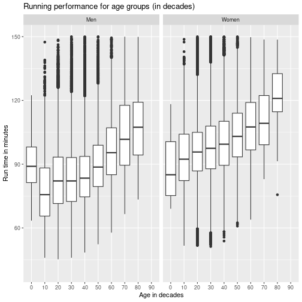
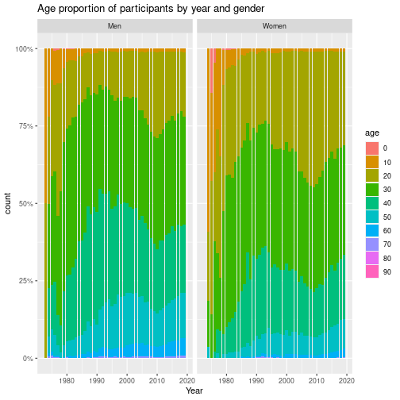

```r
# library inclusions
require(dplyr)
require(stringr)
require(tidyr)
require(ggplot2)
require(rdrobust)
require(AER)
require(plm)
require(stargazer)
```


```r
# load in cleaned data
df <- read.csv(file = "cleaned_data_csv.csv")
repeat_runners <- read.csv(file = "same_runners.csv")
```


```r
# renaming variables for convenience and consistency
df <- df %>%
  rename(year = Year) %>%
  rename(name = Name) %>%
  rename(age = Age) %>%
  rename(t_hour = T_Hour) %>%
  rename(t_min = T_Min) %>%
  rename(t_sec = T_Sec) %>%
  rename(p_min = P_Min) %>%
  rename(p_sec = P_Sec) %>%
  rename(pis.tis = PiS.TiS) %>%
  rename(pid.tid = PiD.TiD) %>%
  rename(hometown = Hometown)

repeat_runners <- repeat_runners %>%
  rename(name = Name) %>%
  rename(year_of_birth = Year...Age) %>%
  rename(hometown = Hometown) %>%
  rename(races = Races_Ran)
```


```r
# converting Time/Pace into minutes and putting them in separate columns
df <- df %>%
  mutate(time = t_hour * 60 + t_min + t_sec / 60,
         pace = p_min + p_sec / 60)

## create gender column from name
getgender <- function(x) {
  substr(x, nchar(x) - 1, nchar(x) - 1)
}

#
repeat_runners$name <- iconv(enc2utf8(repeat_runners$name), sub = "byte")
repeat_runners <- repeat_runners %>%
  mutate(gender = sapply(name, getgender)) %>%
  mutate(name = str_sub(name, 1, -5))

#
unique(repeat_runners$gender) # 1 case F instead of W
```

```
## [1] "M" "W" "F"
```

```r
repeat_runners <- repeat_runners %>%
  mutate(gender = case_when(gender == "F" ~ "W", TRUE ~ gender))

#
df$name <- iconv(enc2utf8(df$name), sub = "byte")
df <- df %>%
  mutate(gender = sapply(name, getgender)) %>%
  mutate(name = str_sub(name, 1, -5))

#
unique(df$gender) # 1 case F instead of W
```

```
## [1] "M" "W" "F"
```

```r
df <- df %>%
  mutate(gender = case_when(gender == "F" ~ "W", TRUE ~ gender))
```


```r
# Plot "runtime" against "age"
ggplot(data = df,
       aes(x = age,
           y = time)) +
  geom_point(shape = 1, size = 0.5) +
  xlab("age in years") +
  ylab("Run time in minutes") +
  ylim(40, 180) +
  ggtitle("Runtime against age, by gender") +
  facet_wrap(gender ~ .)
```

```
## Warning: Removed 1196 rows containing missing values (`geom_point()`).
```


```r
# Boxplot runtime against age category, by gender
## Create age group by decade
df <- df %>%
    mutate(agecat = 10 * floor(age / 10)) %>%
    mutate(agecat = as.character(agecat))

ggplot(data = df,
  aes(x = agecat,
      y = time)) + # by age groups in decades
  geom_boxplot() + # boxplot
  ylab("Run time in minute") +
  ylim(40, 150) +
  ggtitle("Composition of age groups for each performance percentile") +
  labs(fill = "age groups in decade") +
  facet_wrap(gender ~ .)
```

```
## Warning: Removed 1509 rows containing non-finite values (`stat_boxplot()`).
```




```r
# Linear regression
df <- df %>%
  filter(!is.na(time))
model <- lm(time ~ age + gender + age:gender, data = df)
summary(model)
```

```
## 
## Call:
## lm(formula = time ~ age + gender + age:gender, data = df)
## 
## Residuals:
##     Min      1Q  Median      3Q     Max 
## -46.843 -10.726  -1.149   9.425 115.116 
## 
## Coefficients:
##              Estimate Std. Error t value Pr(>|t|)    
## (Intercept) 73.248319   0.138429 529.139  < 2e-16 ***
## age          0.308354   0.003458  89.177  < 2e-16 ***
## genderW     15.721519   0.197472  79.614  < 2e-16 ***
## age:genderW -0.031402   0.005228  -6.006  1.9e-09 ***
## ---
## Signif. codes:  0 '***' 0.001 '**' 0.01 '*' 0.05 '.' 0.1 ' ' 1
## 
## Residual standard error: 15.36 on 340331 degrees of freedom
## Multiple R-squared:  0.1861,	Adjusted R-squared:  0.1861 
## F-statistic: 2.595e+04 on 3 and 340331 DF,  p-value: < 2.2e-16
```


```r
# Residual diagnostic
plot(fitted(model), rstandard(model)); abline(0, 0) # residual pattern against fitted response
```


```r
qqnorm(rstandard(model)); qqline(rstandard(model)) # normality of residual
```


```r
hist(rstandard(model),
  breaks = 30,
  xlim = c(-6, 6),
  freq = FALSE); curve(dnorm, add = TRUE)
```


```r
smoothScatter(x = df$age,
  y = model$residuals,
  xlab = "ages",
  ylab = "Residuals"); abline(h = 0)
```


```r
# # DISABLED: this takes a reallyyyyy long time: temporarily disabling
# resid.lo <- loess(resids ~ age,
#   data = data.frame(resids = rstandard(model),
#   age = df$age))

# res.lo.pred <- predict(resid.lo, newdata = data.frame(age = 10:100))
#   smoothScatter(x = df$age,
#     y = model$residuals,
#     xlab = "ages",
#     ylab = "Residuals")
# abline(h = 0)
# lines(x = 10:100, y = res.lo.pred, col = "red", lwd = 2, lty = 3)
```


```r
# Non parametric model
df.m <- df[df$gender == "M",]
df.w <- df[df$gender == "W",]


# # DISABLED: this takes a reallyyyyy long time: temporarily disabling
# model.loess.m <- loess(time ~ age, data = df.m)
# model.loess.w <- loess(time ~ age, data = df.w)

# plot(y = predict(model.loess.m), x = df.m$age,
#      xlab = "age",
#      ylab = "Predicted time (minutes)",
#      main = "Prediction of Performance using Nonparametric model - Men (Loess method)")

# plot(y=predict(model.loess.w), x=df.w$age,
#      xlab = "age",
#      ylab = "Predicted time (minutes)",
#      main = "Prediction of Performance using Nonparametric model - Women (Loess method)")
```


```r
# NEED SOME DESCRIPTIVE STATISTICS HERE!
# TABLES and GRAPHS show info of age, running time, missing data, number of
# observations (average, median, max, min) by YEAR
# eg. histogram of age (show the composition of age in each race, remember to
# include the number of observations in notes/legend/etc)
# eg. histogram of age by gender (for those years that number of repeat_runners are
# stable and without many missing data - LOOK OUT FOR MISSING DATA - is there a
# pattern in missing data???)

# A GRAPH IN VIZUALIZATION LAB WE DIDN"T NEED TO DRAW
# the one I sent on 11/14/2022 10:44 AM

# Maybe the GRAPH IN VIZUALIZATION LAB we did draw as our answer.

# Answer questions (with graph and/or statistics):
# ? What is the peak performing age for men? for women?
# https://pubmed.ncbi.nlm.nih.gov/31174325/
# ? What is the slow down rate after peak age of men? of women? (percent per
# decade? choose another unit of measurement if you find it"s more
# accurate/intuitive)

# temporary dataframe
temp <- df %>%
  select(year, age) %>%
  mutate(age = as.character(10 * floor(age / 10)))

# age_labels <- c(
#     "<10",
#     "10-19",
#     "20-29",
#     "30-39",
#     "40-49",
#     "50-59",
#     "60-69",
#     "70-79",
#     "80-89",
#     ">89"
#     )

# stacked line plot showing age distribution for year
ggplot(temp,
  aes(x = year,
    group = age,
    fill = age)) +
  geom_bar() +
  ggtitle("Age distribution of participants") +
  xlab("Year") +
  ylab("Number of participants")
```


```r
# show proportions for each year
ggplot(temp,
  aes(x = year,
    group = age,
    fill = age)) +
  geom_bar(position = "fill") +
  ggtitle("Age distribution of participants") +
  xlab("Year") +
  ylab("Proportion of participants (%)")
```



```r
# statistics of number of participants for each year
temp <- df %>%
  select(year, age) %>%
  group_by(year)
summarise(temp)
```

```
## # A tibble: 47 × 1
##     year
##    <int>
##  1  1973
##  2  1974
##  3  1975
##  4  1976
##  5  1977
##  6  1978
##  7  1979
##  8  1980
##  9  1981
## 10  1982
## # … with 37 more rows
```

Model using panel data may mitigate omitted variable bias when there is no information on variables that correlate with both the regressors of interest and the independent variable and if these variables are constant in the time dimension or across entities.


```r
# MODEL FOR TRACKED RUNNERS RECORDS
hist(repeat_runners$races, breaks = 40)
```


```r
## Create key variable in df to merge later
df <- df %>% mutate(year_of_birth=year-age)

# create ID for each runner in repeat runner list
rerun <- repeat_runners %>%
  mutate(id=row_number()) %>%
  select(id, name:gender)

## Filter those who ran at least 5 races
rerun <- rerun %>% filter(races>=5)

## Merge the performance info from df
rerun <- rerun %>% left_join(y = df,by = c("name","year_of_birth","gender","hometown"))

check_merge <- rerun %>% # number of races not agree with number of records (maybe due to change of hometown)
  group_by(id) %>%
  summarise(n_races=mean(races),
            n_merge=n()) %>%
  filter(n_races != n_merge)

rerun_dup <- rerun %>% # multiple people with same id (name, yob, gender, hometown) and different performance
  group_by(id,year) %>%
  mutate(n_dup=n()) %>%
  filter(n_dup>1)

# remove merging error
rerun <- rerun %>%
  group_by(id,year) %>%
  mutate(n_dup=n()) %>%
  filter(n_dup==1) %>%
  select(-n_dup)

## Random sampling
# set.seed(2022)
# rerun[rerun$id==sample(max(rerun$id), size=2), ]

## Change id, gender, year to factor variables
rerun <- within(rerun, {
  id <- factor(id)
  gender <- factor(gender)
  year <- factor(year)
})
head(rerun)
```

```
## # A tibble: 6 × 18
## # Groups:   id, year [6]
##   id    name   year_…¹ homet…² races gender year    age t_hour t_min t_sec p_min
##   <fct> <chr>    <int> <chr>   <int> <fct>  <fct> <int>  <int> <int> <int> <int>
## 1 1     Jay J…    1950 Arling…    39 M      1979     29      1     1    48     6
## 2 1     Jay J…    1950 Arling…    39 M      1980     30      0    52    41     5
## 3 1     Jay J…    1950 Arling…    39 M      1981     31      0    54    47     5
## 4 1     Jay J…    1950 Arling…    39 M      1982     32      0    56    53     5
## 5 1     Jay J…    1950 Arling…    39 M      1983     33      0    57    52     5
## 6 1     Jay J…    1950 Arling…    39 M      1984     34      0    54    51     5
## # … with 6 more variables: p_sec <int>, pis.tis <chr>, pid.tid <chr>,
## #   time <dbl>, pace <dbl>, agecat <chr>, and abbreviated variable names
## #   ¹​year_of_birth, ²​hometown
```

```r
## Panel data graph for first 10 runners

ggplot(data = rerun %>%
         filter(as.numeric(id)<11) %>%
         mutate(gender = case_when(
           gender=="M"~"Men",
           gender=="W"~"Women"
         )),
       aes(x = age, y = time, group = id)) +
  geom_line(aes(color=id)) + # line graph
  xlab("Age") +
  ylab("Race time") +
  ggtitle("Running time of top 10 individual runners that participated in the most races") +
  theme(legend.position="none")
```


```r
## Panel data graph for first 50 runners by gender
ggplot(data = rerun %>%
         filter(as.numeric(id)<51) %>%
         mutate(gender = case_when(
           gender=="M"~"Men",
           gender=="W"~"Women"
         )),
       aes(x = age, y = time, group = id)) +
  geom_line(aes(color=id)) + # line graph
  xlab("Age") +
  ylab("Race time") +
  ggtitle("Running time of top 50 individual runners that ran the most races") +
  facet_grid(.~ gender) +
  theme(legend.position="none") +
  stat_summary(group= F, geom="line", fun = "mean", color="black", size=1, linetype="solid")
```


```r
## Panel data graph for first 50 runners by gender with smooth line
ggplot(data = rerun %>%
         filter(as.numeric(id)<51) %>%
         mutate(gender = case_when(
           gender=="M"~"Men",
           gender=="W"~"Women"
         )),
       aes(x = age, y = time, group = id)) +
  geom_line(aes(color=id)) + # line graph
  xlab("Age") +
  ylab("Race time") +
  ggtitle("Running time of individual runners throughout races") +
  facet_grid(.~ gender) +
  theme(legend.position="none") +
  # stat_summary(group= F, geom="line", fun = "mean", color="black", size=1, linetype="solid") +
  geom_smooth(group= F, method = "loess", fill = NA)
```

```
## `geom_smooth()` using formula = 'y ~ x'
```


Based on the average line and Loess smooth line, two possible models are linear and quadratic model.


```r
## OVERALL PANEL DATA MODEL

model.panel <- plm(time~age + gender+age:gender,
                   data = rerun %>%
                     mutate(gender= case_when(
                       gender=="M" ~ "Men",
                       gender=="W" ~ "Women"
                     )),
                   index=c("id", "year"),
                   model = "within",
                   effect = "time")
```

```
## Warning in pdata.frame(data, index): at least one NA in at least one index dimension in resulting pdata.frame
##  to find out which, use, e.g., table(index(your_pdataframe), useNA = "ifany")
```

```r
coeftest(model.panel, vcov. = vcovHC, type = "HC1")
```

```
## 
## t test of coefficients:
## 
##                  Estimate Std. Error t value  Pr(>|t|)    
## age              0.433327   0.018099 23.9421 < 2.2e-16 ***
## genderWomen     18.863707   1.225592 15.3915 < 2.2e-16 ***
## age:genderWomen -0.175017   0.028709 -6.0963 1.093e-09 ***
## ---
## Signif. codes:  0 '***' 0.001 '**' 0.01 '*' 0.05 '.' 0.1 ' ' 1
```

## Difference between elite and non-elite runners

In this section, tracked runners are divided into 03 types of runners: Type 1 - Runners whose average performance is at most 60 minutes; Type 2 - Runners whose average performance is between 80 to 90 minutes; Type 3 - Runners who need at least 110 minutes on average to complete the race. The question investigated in this section is:  Who have lower age-related decline (percent per decade) in performance? Linear model regression is used for simplicity of the interpretation.


```r
# TWO GROUPS OF RUNNERS - ELITE RUNNERS (MORE RACES AND BETTER AVERAGE PERFORMANCE) vs the rest

## Create two types of runners
rerun <- rerun %>%
  mutate(race_size = sapply(strsplit(pis.tis, "/"),
    function(x) as.numeric(x[2]))) %>%
  mutate(place = sapply(strsplit(pis.tis, "/"),
    function(x) as.numeric(x[1])))
```

```
## Warning in FUN(X[[i]], ...): NAs introduced by coercion

## Warning in FUN(X[[i]], ...): NAs introduced by coercion

## Warning in FUN(X[[i]], ...): NAs introduced by coercion
```

```r
# print( rerun %>% filter( place > race_size ) )
rerun <- rerun %>%
  filter(place <= race_size) # discard data errors
rerun <- rerun %>%
  mutate(percentile = 10 * ceiling( 10 * place/race_size))
rerun <- rerun %>%
  group_by(id) %>%
  mutate(avg_time = mean(time),
         avg_performance = mean(percentile))

rerun_type <- rerun %>%
  group_by(id, name, races, year_of_birth, gender) %>%
  summarise(avg_time = mean(time),
         avg_performance = mean(percentile))
```

```
## `summarise()` has grouped output by 'id', 'name', 'races', 'year_of_birth'. You can override using the
## `.groups` argument.
```

```r
densityPlot(rerun_type$avg_time)
```


```r
## base on this plot ->
## 1. elite = complete the race no more than 60 minutes
## 2. complete the race in between 80-90 minutes
## 3. complete the race in more than 110 minutes

densityPlot(rerun_type[rerun_type$avg_time<=60,]$avg_performance)
```


```r
densityPlot(rerun_type[rerun_type$avg_time<=60,]$races) # elite runners may not participate in many races
```


```r
rerun_type <- rerun_type %>%
  mutate(run_type=as.factor(case_when(
    avg_time<=60 ~ 1,
    avg_time>=80 & avg_time<=90 ~ 2,
    avg_time>=110 ~ 3
  )))

## Check how many people in each type of runners
rerun_type %>%
  group_by(run_type) %>%
  summarise(num_runners=n())
```

```
## # A tibble: 4 × 2
##   run_type num_runners
##   <fct>          <int>
## 1 2               2018
## 2 3                584
## 3 1                170
## 4 <NA>            5004
```

```r
## Merge back the type to the performance across years dataset
rerun <- rerun %>% left_join(y=rerun_type %>%
                               select(-avg_time,-avg_performance),
                             by = c("id", "name", "races",
                                    "year_of_birth", "gender"))

## Regress Time running on age for each group
# list.panel_bytype <- lapply(1:3,
#                             function(i) {
#                               plm(time~age+gender,
#                                   data = rerun %>%
#                                     filter(run_type==i),
#                                   index=c("id", "year"),
#                                   model = "within",
#                                   effect = "time")
#   })
# sapply(list.panel_bytype,
#        function(x) print(coeftest(x, vcov. = vcovHC, type = "HC1" )))

model.panel_t1 <- plm(time~age+gender:age,
                   data = rerun %>% filter(run_type==1, age>=10),
                   index=c("id", "year"),
                   model = "within",
                   effect = "time")
# t1_check <- lm(time ~ age + gender + year,
#               data = rerun %>% filter(run_type==1, age>=10))
# summary(t1_check)
model.panel_t2 <- plm(time~age+gender:age,
                   data = rerun %>% filter(run_type==2, age>=10),
                   index=c("id", "year"),
                   model = "within",
                   effect = "time")
model.panel_t3 <- plm(time~age+gender:age,
                   data = rerun %>% filter(run_type==3, age>=10),
                   index=c("id", "year"),
                   model = "within",
                   effect = "time")

coeftest(model.panel_t1, vcov. = vcovHC, type = "HC1")
```

```
## 
## t test of coefficients:
## 
##             Estimate Std. Error t value  Pr(>|t|)    
## age         0.175231   0.028838  6.0765 1.708e-09 ***
## age:genderW 0.029705   0.021742  1.3663    0.1721    
## ---
## Signif. codes:  0 '***' 0.001 '**' 0.01 '*' 0.05 '.' 0.1 ' ' 1
```

```r
coeftest(model.panel_t2, vcov. = vcovHC, type = "HC1")
```

```
## 
## t test of coefficients:
## 
##              Estimate Std. Error t value  Pr(>|t|)    
## age         0.1311107  0.0096168 13.6335 < 2.2e-16 ***
## age:genderW 0.0154374  0.0045765  3.3732 0.0007449 ***
## ---
## Signif. codes:  0 '***' 0.001 '**' 0.01 '*' 0.05 '.' 0.1 ' ' 1
```

```r
coeftest(model.panel_t3, vcov. = vcovHC, type = "HC1")
```

```
## 
## t test of coefficients:
## 
##              Estimate Std. Error t value  Pr(>|t|)    
## age         0.1877735  0.0268689  6.9885 3.274e-12 ***
## age:genderW 0.0056832  0.0139225  0.4082    0.6831    
## ---
## Signif. codes:  0 '***' 0.001 '**' 0.01 '*' 0.05 '.' 0.1 ' ' 1
```

The result from regression model suggest that:

(1) For male runners, getting older 1 year will likely to slow them down by 0.17 ~ 0.18 minute if they are type 1 or type 3 runners, which would translate to almost 2 minutes after a decade. But for type 2 male runners, the effect of getting 1 year older is at 0.13 minutes on average.

(2) For fmale runners, getting older 1 year will likely to slow them down by 0.18 ~ 0.2 minute if they are type 1 or type 3 runners, which would translate to almost 2 minutes after a decade. But for type 2 female runners, the effect of getting 1 year older is at 0.15 minutes on average.

(3) The effect of age on running time may not necessarily different between genders among type 1 and type 3 runners. However, among type 2 runners, we are 95% confident that the effect of aging on women is different from that on men.

Again, type 1 are fastest group, type 3 are the slowest group. Based on this result, ...


```r
## Panel data graph for type-1,2,3 runners by gender with smooth line
ggplot(data = rerun %>% filter(run_type==1, age>=10),
       aes(x = age, y = time, group = id)) +
  geom_line(aes(color=id)) + # line graph
  xlab("Age") +
  ylab("Race time") +
  ggtitle("Running time of type-1 runners throughout races") +
  facet_grid(.~ gender) +
  theme(legend.position="none") +
  # geom_abline(slope=model.panel_t1$coefficients[1],
  #             intercept= summary(t1_check)$coefficients[1,1],
  #             color='red') +
  geom_smooth(group= F, method = "loess", fill = NA)
```

```
## `geom_smooth()` using formula = 'y ~ x'
```


```r
ggplot(data = rerun %>% filter(run_type==2, age>=10),
       aes(x = age, y = time, group = id)) +
  geom_line(aes(color=id)) + # line graph
  xlab("Age") +
  ylab("Race time") +
  ggtitle("Running time of type-2 runners throughout races") +
  facet_grid(.~ gender) +
  theme(legend.position="none") +
  # geom_abline(slope=model.panel_t1$coefficients[1],
  #             intercept= summary(t1_check)$coefficients[1,1],
  #             color='red') +
  geom_smooth(group= F, method = "loess", fill = NA)
```

```
## `geom_smooth()` using formula = 'y ~ x'
```


```r
ggplot(data = rerun %>% filter(run_type==3, age>=10),
       aes(x = age, y = time, group = id)) +
  geom_line(aes(color=id)) + # line graph
  xlab("Age") +
  ylab("Race time") +
  ggtitle("Running time of type-3 runners throughout races") +
  facet_grid(.~ gender) +
  theme(legend.position="none") +
  # geom_abline(slope=model.panel_t1$coefficients[1],
  #             intercept= summary(t1_check)$coefficients[1,1],
  #             color='red') +
  geom_smooth(group= F, method = "loess", fill = NA)
```

```
## `geom_smooth()` using formula = 'y ~ x'
```


```r
## all-in-one graph
ggplot(data = rerun %>% filter(!is.na(run_type), age>=10)
       %>% mutate(run_type=case_when(
         run_type==1 ~ "Type 1",
         run_type==2 ~ "Type 2",
         run_type==3 ~ "Type 3"))
       %>% mutate(gender=case_when(
         gender=="M" ~ "Men",
         gender=="W" ~ "Women"
       )),
       aes(x = age, y = time, group = id)) +
  geom_line(aes(color=id)) + # line graph
  xlab("Age") +
  ylab("Race time") +
  ggtitle("Running time of different runner type throughout races") +
  facet_grid(rows = vars(gender),
             cols = vars(run_type)) +
  theme(legend.position="none") +
  # geom_abline(slope=model.panel_t1$coefficients[1],
  #             intercept= summary(t1_check)$coefficients[1,1],
  #             color='red') +
  geom_smooth(group= F, method = "loess", fill = NA)
```

```
## `geom_smooth()` using formula = 'y ~ x'
```


```r
# addrunner <- function(listrunners, color, numlty) {
#   numrunners = length(listrunners)
#   colindx = 1 +(1:numrunners)%%length(colors)
#   ltys = rep(1:numlty, each=length(colors), length=numrunners)
#
#   mapply(function(df,i) {
#     lines(df$times ~df$age,
#           col=colors[colindx[i]], lwd=2, lty=ltys[i])
#   },listrunners, i=1:numrunners)
# }


##
# QUESTIONS
# ? Who have lower age-related decline (percent per decade) in performance?
# elite repeat_runners or mortal (based on running time to decide who are elite repeat_runners
# or based on Cherry Blossom elite repeat_runners record)? men/women? -> recommendation
# to take up running as a hobby, professional training?
# https://www.frontiersin.org/articles/10.3389/fphys.2021.649282/full
# actually, I think this should be done with the tracked runner record rather
# than cross-section data - will look into it.
# https://researchoutreach.org/articles/ageing-change-sport-performance-master-athletes-answer/
```


## Peak age and peak performance

Under observation that maximal oxygen uptake—a main correlate of running speed—varied in an inverse U trend across life-time (Rate and mechanism of maximal oxygen consumption decline with aging:
Implications for exercise training. Sports Med. 2003, 33, 877–888.), it is possible that performance follows quadratic model, which is the basis of this section investigating runners' peak age and peak performance. The information can be useful for athletes and trainers in designing training and practicing strategy.


```r
# AGE OF PEAK PERFORMANCE
# Quadratic regression time~age + age2 + age:gender

## Using cross-sectional data
# model.peak <- lm(time~age+age2+age:gender,
#                  data=df %>% mutate(age2=age^2)); summary(model.peak)
#
# model.peak_m <- lm(time~age+age2,
#                  data=df %>%
#                    mutate(age2=age^2) %>%
#                    filter(gender=="M")); summary(model.peak_m)
# model.peak_w <- lm(time~age+age2,
#                  data=df %>%
#                    mutate(age2=age^2) %>%
#                    filter(gender=="W")); summary(model.peak_w)
# # peak age = x* = -b/2a
# pa_m <- -summary(model.peak_m)$coefficients[2,1]/(2*summary(model.peak_m)$coefficients[3,1]); pa_m
# pa_w <- -summary(model.peak_w)$coefficients[2,1]/(2*summary(model.peak_w)$coefficients[3,1]); pa_w
#
# # performance at peak age
# pperf_m <- predict(model.peak_m, data.frame(age=pa_m, age2=pa_m^2), level=0.95, interval= "confidence"); pperf_m
# pperf_w <- predict(model.peak_w, data.frame(age=pa_w, age2=pa_w^2), level=0.95, interval= "confidence"); pperf_w

## Using panel data
model.panel_pa <- plm(time~age+age2+gender,
                      data= rerun %>%
                        mutate(age2=age^2) %>%
                        filter(age>=10),
                      index= c("id","year"),
                      method="within",
                      effect = "time")
model.panel_pa <- lm(time ~ age + age2 + gender + year,
               data = rerun %>%
                        mutate(age2=age^2) %>%
                        filter(age>=10))
summary(model.panel_pa)
```

```
## 
## Call:
## lm(formula = time ~ age + age2 + gender + year, data = rerun %>% 
##     mutate(age2 = age^2) %>% filter(age >= 10))
## 
## Residuals:
##     Min      1Q  Median      3Q     Max 
## -42.517  -9.293  -0.748   8.250  87.341 
## 
## Coefficients:
##               Estimate Std. Error t value Pr(>|t|)    
## (Intercept) 66.8670636 13.4374534   4.976  6.5e-07 ***
## age         -0.4551140  0.0360924 -12.610  < 2e-16 ***
## age2         0.0090433  0.0003909  23.137  < 2e-16 ***
## genderW     11.2395683  0.1253231  89.685  < 2e-16 ***
## year1974    -0.9933814 14.0782935  -0.071   0.9437    
## year1975    -2.3333823 14.0783852  -0.166   0.8684    
## year1976    -4.5331365 14.0784830  -0.322   0.7475    
## year1977    -4.5843105 14.0785849  -0.326   0.7447    
## year1978    -4.5578486 14.1495335  -0.322   0.7474    
## year1979    10.6458619 13.4515298   0.791   0.4287    
## year1980     8.1116455 13.4470218   0.603   0.5464    
## year1981     9.6681936 13.4399815   0.719   0.4719    
## year1982     9.2425933 13.4372075   0.688   0.4916    
## year1983     7.6459327 13.4358834   0.569   0.5693    
## year1984     8.6195616 13.4349304   0.642   0.5211    
## year1985     7.9789353 13.4341828   0.594   0.5526    
## year1986     8.8971155 13.4334821   0.662   0.5078    
## year1987     8.8058036 13.4337605   0.655   0.5121    
## year1988    10.2465640 13.4329188   0.763   0.4456    
## year1989     9.7977912 13.4330400   0.729   0.4658    
## year1990     9.7755849 13.4339604   0.728   0.4668    
## year1991    11.7045878 13.4318987   0.871   0.3835    
## year1992    10.9414743 13.4335657   0.814   0.4154    
## year1993    12.4012001 13.4325281   0.923   0.3559    
## year1994    14.7067119 13.4316541   1.095   0.2736    
## year1995    14.5913269 13.4308184   1.086   0.2773    
## year1996    14.7785865 13.4302891   1.100   0.2712    
## year1997    16.9482372 13.4300186   1.262   0.2070    
## year1998    16.1378272 13.4297539   1.202   0.2295    
## year1999    17.1261132 13.4297784   1.275   0.2022    
## year2000    16.3910697 13.4298681   1.220   0.2223    
## year2001    17.0752851 13.4290439   1.272   0.2035    
## year2002    18.2547982 13.4288284   1.359   0.1740    
## year2003    17.4907958 13.4286053   1.303   0.1928    
## year2004    18.2768672 13.4285801   1.361   0.1735    
## year2005    19.6024597 13.4284878   1.460   0.1444    
## year2006    19.8911598 13.4277755   1.481   0.1385    
## year2007    18.9166377 13.4278778   1.409   0.1589    
## year2008    20.2358517 13.4276823   1.507   0.1318    
## year2009    20.7048677 13.4273329   1.542   0.1231    
## year2010    21.5281955 13.4273332   1.603   0.1089    
## year2011    21.8219556 13.4271863   1.625   0.1041    
## year2012    21.2332633 13.4270697   1.581   0.1138    
## year2013    22.4509260 13.4269588   1.672   0.0945 .  
## year2014    22.8888970 13.4271996   1.705   0.0883 .  
## year2015    18.2209050 13.4273990   1.357   0.1748    
## year2016    24.3630068 13.4279092   1.814   0.0696 .  
## year2017    23.6992434 13.4280573   1.765   0.0776 .  
## year2018    24.8566220 13.4283783   1.851   0.0642 .  
## year2019    24.0832667 13.4289767   1.793   0.0729 .  
## ---
## Signif. codes:  0 '***' 0.001 '**' 0.01 '*' 0.05 '.' 0.1 ' ' 1
## 
## Residual standard error: 13.42 on 54970 degrees of freedom
## Multiple R-squared:  0.305,	Adjusted R-squared:  0.3044 
## F-statistic: 492.4 on 49 and 54970 DF,  p-value: < 2.2e-16
```

```r
model.panel_pa_m <- lm(time ~ age + age2 + year,
               data = rerun %>%
                        mutate(age2=age^2) %>%
                        filter(age>=10, gender=="M"))
model.panel_pa_w <- lm(time ~ age + age2 + year,
               data = rerun %>%
                        mutate(age2=age^2) %>%
                        filter(age>=10, gender=="W"))
# peak age = x* = -b/2a
pa_m <- -summary(model.panel_pa_m)$coefficients[2,1]/(2*summary(model.panel_pa_m)$coefficients[3,1]); pa_m
```

```
## [1] 23.48294
```

```r
pa_w <- -summary(model.panel_pa_w)$coefficients[2,1]/(2*summary(model.panel_pa_w)$coefficients[3,1]); pa_w
```

```
## [1] 22.11456
```

```r
# performance at peak age
pperf_m <- predict(model.panel_pa_m, data.frame(age=pa_m, age2=pa_m^2, year=as.factor(2019)), level=0.95, interval= "confidence"); pperf_m
```

```
##        fit      lwr      upr
## 1 83.63635 82.60917 84.66353
```

```r
pperf_w <- predict(model.panel_pa_w, data.frame(age=pa_w, age2=pa_w^2, year=as.factor(2019)), level=0.95, interval= "confidence"); pperf_w
```

```
##        fit      lwr      upr
## 1 98.03589 96.81228 99.25951
```

From the record of tracked runners, filtered people at least 10 years old, using time-fixed effect model, the peak age of performance for men is 23.5 (95% confidence to be between 82.6, 84.7 minutes) and women is 22.1 (95% confidence to be between 96.8, 99.3 minutes).


```
## [1] 26.45592
```

```
## [1] 25.96515
```

```
##        fit      lwr      upr
## 1 77.48743 77.07538 77.89947
```

```
##        fit      lwr      upr
## 1 92.69555 92.21839 93.17272
```


From the record of tracked runners, filtered people at least 10 years old, using quadratic regression model, the peak age of performance for men is 26.5 (95% confidence to be between 77.1, 77.9 minutes) and women is 26 (95% confidence to be between 92.2, 93.2 minutes).


```r
random_subset <- df %>% sample_n(200) # oof idk man

# # DISABLED: this takes a reallyyyyy long time: temporarily disabling
# resid.lo <- loess(resids ~ age,
#   data = data.frame(resids = rstandard(model),
#   age = df$age))
# res.lo.pred <- predict(resid.lo, newdata = data.frame(age = 10:100))

# smoothScatter(x = df$age,
#   y = model$residuals,
#   xlab = "ages",
#   ylab = "Residuals")

# abline(h = 0)
# lines(x = 10:100,
#     y = res.lo.pred,
#     col = "red",
#     lwd = 2,
#     lty = 3)
```


```r
rdplot(narrow$yvar, narrow$school_enrollment, c = 40.5, p = 1, nbins = 20)
```


```r
#Collapse data
by_school <- group_by(narrow, schlcode)
schools <- summarise(by_school, school_enrollment =
mean(school_enrollment, na.rm = TRUE))
#Draw graph
ggplot(schools, aes(school_enrollment)) +
 geom_histogram(bins = 40) +
 geom_vline(xintercept = 40.5, color = "red")
#Save graph
ggsave("school_counts.png")
```


```r
# Use PiS/Tis to create place in percentile
## Extract position and total number of repeat_runners in each race
df <- df %>%
  mutate(race_size = sapply(strsplit(place, "/"),
    function(x) as.numeric(x[2]))) %>%
  mutate(place = sapply(strsplit(place, "/"),
    function(x) as.numeric(x[1])))
```

